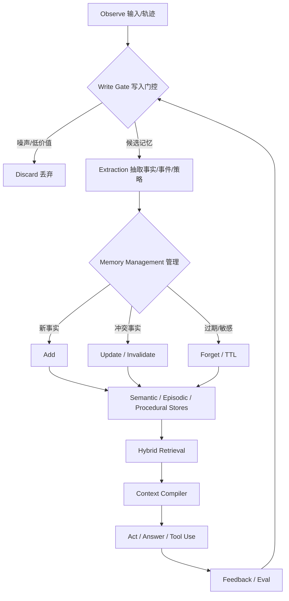
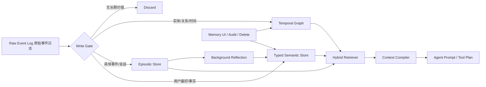
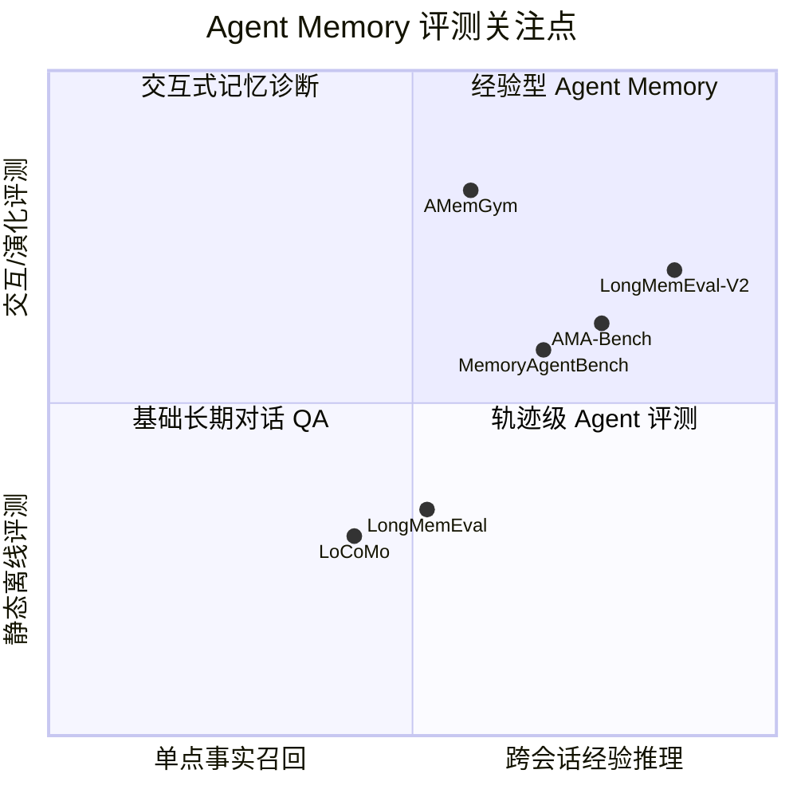

本文内容由 AI 协助生成；文中关键判断均尽量标注源头出处，引用索引见文末。

## 核心论点

Agent Memory 正在从“给 LLM 接一个向量库”演进为一层独立的 **状态管理、经验抽象与治理系统**。这个判断并不是单一产品的营销说法，而是多条研究与工程线索共同指向的趋势：2026 年综述将 memory 视为 Foundation Agent 在长时程、动态环境中获得真实效用的关键机制，并从 memory substrate、cognitive mechanism、memory subject 三个维度重构分类体系 [[S1]](#s1)；MemGPT/Letta 则把记忆管理显式类比为操作系统的虚拟内存与分页机制 [[P1]](#p1)[[D1]](#d1)；LangMem、Mem0、Zep/Graphiti 等系统也都在把“写入、更新、检索、固化、遗忘”做成可编程能力，而不是一次性的 RAG 查询 [[D2]](#d2)[[P2]](#p2)[[D5]](#d5)。

真正的 Agent Memory 不是“存更多聊天记录”，而是让 Agent 知道什么值得记、如何更新、何时召回、何时遗忘，以及如何把经历压缩成可迁移的经验。

### TL;DR

1. **Long Context 不能替代 Memory**：长上下文解决的是“能塞多少”，memory 解决的是“什么值得带入下一次决策” [[B2]](#b2)[[B3]](#b3)。
2. **Memory OS 是重要范式**：MemGPT/Letta 把核心记忆、归档记忆、上下文分页和 agent 自编辑记忆统一到一个运行时模型中 [[P1]](#p1)[[D1]](#d1)。
3. **Typed Memory 成为工程共识**：semantic、episodic、procedural、working memory 应该分开建模，而不是混在一个向量集合中 [[S1]](#s1)[[D2]](#d2)。
4. **Graph Memory 正在升温，但不是默认答案**：Zep/Graphiti、Cognee、Neo4j Agent Memory 都强调图结构、时间关系和实体关系；但图的 schema、抽取和运维成本也更高 [[D5]](#d5)[[D6]](#d6)[[D7]](#d7)。
5. **评测正在从 recall 走向 agentic memory**：LoCoMo、LongMemEval、MemoryAgentBench、AMA-Bench、LongMemEval-V2 等 benchmark 正在把多会话、时间推理、知识更新、选择性遗忘和 agent 轨迹纳入评测 [[B1]](#b1)[[B2]](#b2)[[B3]](#b3)[[B4]](#b4)[[B6]](#b6)。

---

## 一、为什么 Memory 不只是 RAG 或 Long Context？

很多讨论会把 RAG、long context 和 agent memory 混为一谈。更准确的区分是：

| 能力 | 解决什么 | 不解决什么 | 代表形态 |
| :--- | :--- | :--- | :--- |
| RAG | 从外部知识库取相关材料 | 不负责持续学习、偏好更新、自我状态 | 向量库、BM25、GraphRAG |
| Long Context | 在一次推理中放入更多 token | 不提供持久化、治理、删除、经验抽象 | 128K/1M/10M context |
| Agent Memory | 跨时间维护可更新状态和经验 | 需要额外写入、检索、治理成本 | Letta、LangMem、Mem0、Zep |

MemoryAgentBench 明确指出，memory 和 long context 存在根本差异：memory 是对过往信息的压缩、蒸馏与选择性表示，而不是把所有历史原样塞进上下文 [[B3]](#b3)。LongMemEval-V2 进一步把长期记忆评测推进到 web agent 历史轨迹，并区分 static/dynamic、workflow、gotcha、premise 等能力维度，说明研究关注点已经从“长文本召回”转向“经验记忆” [[B6]](#b6)。

Long Context 是更大的工作台；Agent Memory 是决定哪些材料该被放上工作台的管理层。

---

## 二、理论前沿：从存储到经验

### 1. 认知分类：不是一种 memory，而是一组 memory

2026 年综述《Rethinking Memory Mechanisms of Foundation Agents in the Second Half》把 foundation agent memory 放在三个维度下讨论：memory substrate、cognitive mechanism、memory subject，并将 episodic、semantic、sensory、working、procedural memory 纳入统一框架 [[S1]](#s1)。LangMem 文档也把长期记忆区分为 semantic、episodic、procedural 三类，并提供对应的管理方式 [[D2]](#d2)。

| 类型 | 记什么 | 工程实现 | 典型风险 | 来源 |
| :--- | :--- | :--- | :--- | :--- |
| Working Memory | 当前任务目标、短期上下文、推理 scratchpad | prompt window、thread state、recent messages | 窗口溢出、状态丢失 | [[S1]](#s1) |
| Episodic Memory | 某次会话、某次工具调用、某个事件何时发生 | raw event log、session transcript、event store | 噪声大、检索片段过长 | [[S1]](#s1)[[E3]](#e3) |
| Semantic Memory | 用户偏好、事实、实体属性、项目知识 | KV、document store、vector index、knowledge graph | 旧事实冲突、来源丢失 | [[D2]](#d2)[[P2]](#p2) |
| Procedural Memory | 做事方式、工作流、prompt policy、工具使用策略 | skill library、prompt optimizer、reflection output | 错误经验固化 | [[D2]](#d2)[[S1]](#s1) |
| Reflective / Experience Memory | 从多次经历中抽象出的可迁移经验 | background reflection、sleep-time consolidation | 过度总结、不可追溯 | [[D1]](#d1)[[B6]](#b6) |

### 2. 生命周期：observe -> write -> manage -> retrieve -> act -> update

一个成熟的 memory 系统通常不是单点检索，而是完整生命周期：观察输入、判断是否写入、抽取事实、合并/更新、存储、检索、编译进上下文、执行、再根据反馈更新。2026 年《Memory in the LLM Era》把 memory mechanism 拆成 Information Extraction、Memory Management、Memory Storage、Information Retrieval 四阶段，并在 LoCoMo 与 LongMemEval 上比较不同方法 [[S2]](#s2)。

### 3. Memory OS：Agent 自己管理记忆

MemGPT 的原始论文标题就是 *Towards LLMs as Operating Systems*，其核心比喻是：LLM 的 context window 类似 RAM，外部存储类似 disk，agent 需要像 OS 一样在有限上下文和长期存储之间移动信息 [[P1]](#p1)。Letta 作为 MemGPT 的后续平台，把这种思想产品化为 stateful agents，并在 Letta Code 中提供 agent 自编辑 memory、`/remember`、sleep-time subagents、git-backed MemFS 等机制 [[D1]](#d1)。

这条路线的前沿意义在于：memory 不是外部服务返回给 agent 的几条文本，而是 agent state 的一部分。Agent 可以显式查看、修改、提交、回滚自己的长期上下文。

---

## 三、实践系统与项目版图

### 1. 主流系统对比

| 系统 | 记忆形态 | 关键能力 | 适合场景 | 局限/注意点 | 主要出处 |
| :--- | :--- | :--- | :--- | :--- | :--- |
| Letta / MemGPT | Core memory + archival memory + self-editing runtime | Agent 自主管理记忆、分页、长期 stateful agent、MemFS | 长期 coding/research/support agent | 与运行时耦合较强，memory 质量依赖 agent 管理策略 | [[P1]](#p1)[[D1]](#d1) |
| LangMem / LangGraph Store | semantic / episodic / procedural memory + LangGraph store | hot path memory tools、background manager、prompt optimization | 已使用 LangGraph 的工程团队 | 需要开发者设计 namespace、schema 和写入策略 | [[D2]](#d2) |
| Mem0 | fact extraction + scalable long-term memory + optional graph memory | 用户/会话/agent 多级 memory、抽取/合并/检索、SDK/托管服务 | 快速给应用接入长期个性化记忆 | 托管能力强，但深度可控性取决于接口 | [[P2]](#p2)[[D3]](#d3) |
| Zep / Graphiti | temporal knowledge graph + context assembly | 时间有效性、动态关系、历史查询、GraphRAG | CRM、金融、医疗、账号历史等变化事实场景 | 图抽取、schema、查询与平台依赖成本更高 | [[P3]](#p3)[[D4]](#d4)[[D5]](#d5) |
| Cognee | vector + graph + cognitive memory knowledge engine | 多格式 ingestion、图/向量混合、tenant isolation、traceability | 文档/知识库/跨 agent 知识共享 | 更像知识引擎，需要自己接 agent runtime | [[D6]](#d6) |
| Neo4j Agent Memory | graph-native memory / context graph | 会话、实体抽取、关系抽取、MCP、Neo4j 图查询 | 已有 Neo4j 或强实体关系需求的团队 | 图数据库运维与实体抽取质量是关键 | [[D7]](#d7) |
| LlamaIndex / LangChain legacy memory | buffer、summary、message history、retriever memory | 简单聊天记忆、框架内低门槛 | 原型、单会话工具 | 多数默认 memory 是 session-local 或 transcript-level，不等于长期事实记忆 | [[E1]](#e1)[[E2]](#e2) |

### 2. 三条工程路线

**路线 A：Memory-as-runtime。** Letta/MemGPT 把 agent runtime 和 memory 合在一起。优势是 agent 对 memory 的读写是原生动作；劣势是你接受的不只是一个 memory backend，而是一套运行时 [[P1]](#p1)[[D1]](#d1)。

**路线 B：Memory-as-layer。** Mem0、Zep、Cognee、Neo4j Agent Memory 更像外接记忆层。应用在每轮对话前检索、每轮对话后写入，或者在后台做抽取、合并、时间标注 [[P2]](#p2)[[D5]](#d5)[[D6]](#d6)[[D7]](#d7)。

**路线 C：Memory-as-framework primitive。** LangMem/LangGraph 让 memory 成为 agent graph 的 store/tool/prompt optimization 能力，更适合已经基于 LangGraph 编排的团队 [[D2]](#d2)。

### 3. 生产级架构

这张图背后的工程判断来自多方实践：LangMem 提供 hot path 与 background memory manager [[D2]](#d2)；Letta Code 使用 sleep-time subagents 做后台记忆整理 [[D1]](#d1)；Mem0 工程文章强调写入路径做 fact extraction 和 reconciliation，检索路径在 prompt 构建时注入紧凑记忆 [[E5]](#e5)；Zep/Graphiti 则把动态事实放入 temporal knowledge graph，以支持历史查询和变化关系 [[D5]](#d5)。

---

## 四、工程设计原则

### 1. 保留 raw event log

Raw log 是 memory 系统唯一的后悔药。 摘要、事实抽取、图构建都会丢信息；如果不保留原始事件，一旦抽取 prompt、embedding 模型或 schema 出错，就无法重新构建 memory。Mem0 相关工程实践通常把 ingestion 与 retrieval 分离，先保存或处理对话，再抽取 durable facts [[E5]](#e5)。Letta 的 MemFS 也体现了可审计、可版本化 memory 的方向：memory 被组织成 git-backed markdown files，并有完整版本历史 [[D1]](#d1)。

### 2. 写入门控比向量库更重要

所有对话都写入 memory 会导致污染。MemoryAgentBench 对 memory agent 的能力定义中包含 test-time learning、long-range understanding 和 selective forgetting，意味着“记住什么”和“忘掉什么”本身就是被评估的能力 [[B3]](#b3)。AMemGym 进一步强调 write、read、utilization 的交互式诊断，而不仅是离线 QA 准确率 [[B5]](#b5)。

### 3. 检索应当混合，而不是只靠 embedding

Mem0 的检索策略博客把 memory retrieval 分为 recency、semantic、keyword、hybrid with reranking、graph traversal/entity-aware retrieval，并指出不同策略适配不同问题类型 [[E4]](#e4)。这与 Zep/Graphiti 和 Cognee 的图/向量混合方向一致 [[D5]](#d5)[[D6]](#d6)。

推荐的检索策略是：

| 查询类型 | 优先策略 | 例子 |
| :--- | :--- | :--- |
| 最近刚说过的内容 | recency / session buffer | “刚才那个链接是什么？” |
| 偏好/事实召回 | semantic + metadata filter | “我喜欢哪种测试框架？” |
| 精确 ID/代码/人名 | keyword / BM25 / FTS | “TAPD-12345 的结论是什么？” |
| 关系/多跳推理 | graph traversal + semantic | “我的导师的导师是谁？” |
| 时间变化 | temporal graph / temporal rerank | “我现在住哪里，不是去年住哪里？” |

### 4. 更新、冲突和遗忘是一等公民

LongMemEval 明确评估 knowledge updates、temporal reasoning、abstention 等能力 [[B2]](#b2)。Mem0 的 temporal reasoning 文章也指出，memory 不只要知道“是什么”，还要知道“什么时候为真”，并通过时间 metadata 和 reranking 处理 current / historical / upcoming 等查询意图 [[E6]](#e6)。Zep/Graphiti 的 temporal graph 同样强调 `valid_at` / `invalid_at` 风格的历史有效性 [[D4]](#d4)[[D5]](#d5)。

长期记忆最危险的问题不是忘记，而是自信地记住了过期或错误的信息。

### 5. Memory UI 与审计不可省略

个人助理、企业 agent、客服 agent 都会把敏感偏好、身份信息、业务上下文写入 memory。OpenAI、Claude 等产品级 memory 功能都把用户可见、可关闭、可删除作为重要产品机制；工程上也应提供 memory vault、audit log、source pointer、delete/export 能力 [[E7]](#e7)[[E8]](#e8)。

---

## 五、评测前沿：从“能否召回”到“能否演化”

### 1. Benchmark 版图

| Benchmark | 年份 | 评测重点 | 关键结论/贡献 | 出处 |
| :--- | :--- | :--- | :--- | :--- |
| LoCoMo | 2024 | very long-term conversational memory，多 session、persona、temporal event graph | 将长期对话、QA、总结和生成结合，用于评估非常长期对话记忆 | [[B1]](#b1) |
| LongMemEval | 2024/2025 | user-assistant 长期交互记忆 | 覆盖 information extraction、multi-session reasoning、temporal reasoning、knowledge updates、abstention | [[B2]](#b2) |
| MemoryAgentBench | 2025/2026 | incremental multi-turn memory agent | 强调 accurate retrieval、test-time learning、long-range understanding、selective forgetting，指出 long-context benchmark 不能直接替代 memory benchmark | [[B3]](#b3) |
| AMA-Bench | 2026 | agent-environment trajectory memory | 从真实/合成 agentic trajectories 评估 long-horizon memory，指出现有系统缺少 causality 与 objective information | [[B4]](#b4) |
| AMemGym | 2026 | interactive / on-policy memory evaluation | 批评静态 off-policy 评测无法反映 agent 行为后果，提供 write/read/utilization 诊断 | [[B5]](#b5) |
| LongMemEval-V2 | 2026 | web agent experience memory，25M-115M token 级历史 | 从 user-assistant memory 推进到 web agent 经验记忆，强调 workflows、gotchas、premise 等维度 | [[B6]](#b6) |
| EvoMemBench | 2026 | self-evolving agent memory | 区分 in-episode / cross-episode，knowledge evolution / execution evolution | [[B7]](#b7) |

### 2. 评测不能只看 accuracy

一个生产级 memory benchmark 至少要记录：

| 指标 | 为什么重要 | 参考来源 |
| :--- | :--- | :--- |
| Recall / QA accuracy | 基本召回与回答能力 | [[B1]](#b1)[[B2]](#b2) |
| Temporal reasoning | 判断事实何时为真 | [[B2]](#b2)[[E6]](#e6) |
| Knowledge update | 新事实覆盖旧事实 | [[B2]](#b2) |
| Selective forgetting | 不该记或该忘的内容能否被排除 | [[B3]](#b3) |
| Test-time learning | 多轮中能否利用新经验改进 | [[B3]](#b3) |
| Agent trajectory causality | 是否理解工具调用和环境状态因果 | [[B4]](#b4) |
| Write/read/utilization diagnosis | 问题出在写入、读取还是使用 | [[B5]](#b5) |
| Token / latency / cost | 生产可用性 | [[S2]](#s2)[[P2]](#p2) |

---

## 六、落地路线图

### MVP：typed semantic memory + raw log

第一版不要直接上复杂图谱。建议先做：raw event log、typed fact store、metadata、source pointer、user scope、基础 search。Mem0、LangMem、LangGraph Store 都可以支持这类形态 [[D2]](#d2)[[P2]](#p2)。

### 进阶：异步抽取与 consolidation

当 memory 写入开始变多，应把写入分成同步最小路径和异步整理路径。Analytiq Hub 的 Mem0 集成实践就把 durable fact extraction、deduplication、reconciliation 放到后台任务中，检索则在每次 agent turn 开始时并发执行 [[E5]](#e5)。Letta 的 sleep-time subagents 也是相同方向 [[D1]](#d1)。

### 成熟：temporal / graph / procedural memory

当问题转向实体关系、事实变化、跨 episode 经验和工具使用策略时，再引入 temporal graph、procedural memory、prompt optimization。Zep/Graphiti、Cognee、Neo4j Agent Memory 是图方向代表 [[D5]](#d5)[[D6]](#d6)[[D7]](#d7)，LangMem 的 prompt optimization 与 procedural memory 则代表框架内行为改进路线 [[D2]](#d2)。

### 反模式清单

- **全量盲写**：把所有 message embedding 后扔进向量库，短期简单，长期污染。
- **只有 summary，没有 raw log**：摘要错了无法修复。
- **只用 semantic similarity**：对时间、否定、精确 ID、关系查询都脆弱 [[E4]](#e4)。
- **不处理冲突**：旧偏好和新偏好并存，agent 随机召回。
- **没有用户可见控制**：用户不知道 agent 记住了什么，也不能删除。
- **把 benchmark 当产品指标**：LoCoMo/LongMemEval 分数不能直接代表你的业务 agent 可用性；AMA-Bench、AMemGym 等新 benchmark 正是在补这个缺口 [[B4]](#b4)[[B5]](#b5)。

---

## 七、我的判断

未来 12-24 个月，Agent Memory 的竞争重点会从“谁接入最快”转向“谁能稳定管理经验”。具体会体现在四个方向：

1. **Learned memory policy**：用反馈学习何时写、写什么、如何检索、何时忘。
2. **Experience memory**：从会话事实转向跨任务工作流、gotcha、失败经验和工具策略 [[B6]](#b6)。
3. **Temporal + graph hybrid**：不是所有系统都要图，但变化事实和关系密集场景会越来越依赖 temporal graph [[D5]](#d5)。
4. **Memory governance**：source、audit、delete、tenant isolation、privacy boundary 会成为企业采纳的前置条件 [[D6]](#d6)[[D7]](#d7)。

记忆不是 Agent 的附件。对长期运行的 Agent 来说，记忆就是它的状态、经验和人格边界。

---

## 来源索引

### Surveys / 综述

**[S1]** *Rethinking Memory Mechanisms of Foundation Agents in the Second Half: A Survey*, arXiv:2602.06052, 2026. https://arxiv.org/abs/2602.06052

**[S2]** *Memory in the LLM Era: Modular Architectures and Strategies in a Unified Framework*, arXiv:2604.01707, 2026. https://arxiv.org/abs/2604.01707

### Papers / 系统论文

**[P1]** Charles Packer et al., *MemGPT: Towards LLMs as Operating Systems*, arXiv:2310.08560, 2023. https://arxiv.org/abs/2310.08560

**[P2]** Prateek Chhikara et al., *Mem0: Building Production-Ready AI Agents with Scalable Long-Term Memory*, arXiv:2504.19413, 2025. https://arxiv.org/abs/2504.19413

**[P3]** *Zep: A Temporal Knowledge Graph Architecture for Agent Memory*, Zep / Graphiti paper referenced by Graphiti project. https://github.com/getzep/graphiti

### Systems / 官方文档与项目源头

**[D1]** Letta Docs, *Memory | Letta Code*. https://docs.letta.com/letta-code/memory/

**[D2]** LangChain AI, *LangMem* GitHub and docs. https://github.com/langchain-ai/langmem , https://langchain-ai.github.io/langmem/

**[D3]** Mem0 GitHub, *Universal memory layer for AI Agents*. https://github.com/mem0ai/mem0

**[D4]** Zep GitHub, *The Memory Foundation For Your AI Stack*. https://github.com/getzep/zep

**[D5]** Graphiti GitHub, *Build Real-Time Knowledge Graphs for AI Agents*. https://github.com/getzep/graphiti

**[D6]** Cognee GitHub, *Knowledge Engine for AI Agent Memory*. https://github.com/topoteretes/cognee

**[D7]** Neo4j Labs, *Agent Memory*. https://github.com/neo4j-labs/agent-memory

### Benchmarks / 评测基准

**[B1]** Adyasha Maharana et al., *Evaluating Very Long-Term Conversational Memory of LLM Agents*, arXiv:2402.17753, 2024. https://arxiv.org/abs/2402.17753

**[B2]** Di Wu et al., *LongMemEval: Benchmarking Chat Assistants on Long-Term Interactive Memory*, arXiv:2410.10813, 2024/2025. https://arxiv.org/abs/2410.10813

**[B3]** Yuanzhe Hu et al., *Evaluating Memory in LLM Agents via Incremental Multi-Turn Interactions*, arXiv:2507.05257, 2025/2026. https://arxiv.org/abs/2507.05257

**[B4]** Yujie Zhao et al., *AMA-Bench: Evaluating Long-Horizon Memory for Agentic Applications*, arXiv:2602.22769, 2026. https://arxiv.org/abs/2602.22769 , https://github.com/AMA-Bench/AMA-Bench

**[B5]** *AMemGym: Interactive Memory Benchmarking*, arXiv:2603.01966, 2026. https://arxiv.org/abs/2603.01966

**[B6]** *LongMemEval-V2: Evaluating Long-Term Agent Memory*, arXiv:2605.12493, 2026. https://arxiv.org/abs/2605.12493

**[B7]** *EvoMemBench: Benchmarking Agent Memory from a Self-Evolving Perspective*, arXiv:2605.18421, 2026. https://arxiv.org/abs/2605.18421

### Engineering Blogs / 工程博客与实践材料

**[E1]** Mem0 Blog, *How to add Memory to Langchain Agents*, 2026. https://mem0.ai/blog/how-to-add-memory-to-langchain-agents

**[E2]** Mem0 Blog, *How to add memory to LlamaIndex agents*, 2026. https://mem0.ai/blog/how-to-add-memory-to-llamaindex-agents

**[E3]** Mem0 Blog, *Episodic memory for AI agents*, 2026. https://mem0.ai/blog/episodic-memory-for-ai-agents

**[E4]** Mem0 Blog, *Memory Retrieval Strategies for AI Agents*, 2026. https://mem0.ai/blog/memory-retrieval-strategies-for-ai-agents

**[E5]** Andrei Radulescu-Banu, *How AI Agent Memory Works (and How We Integrated Mem0)*, Analytiq Hub, 2026. https://analytiqhub.com/ai/engineering/agents/rag/how-mem0-works-and-how-we-integrated-it/

**[E6]** Mem0 Blog, *Introducing Temporal Reasoning in Mem0*, 2026. https://mem0.ai/blog/introducing-temporal-reasoning-in-mem0

**[E7]** OpenAI Help Center, *Memory FAQ*. https://help.openai.com/en/articles/8590148-memory-faq

**[E8]** Anthropic Support, *Memory in Claude*. https://support.anthropic.com/en/articles/10190118-memory-in-claude
