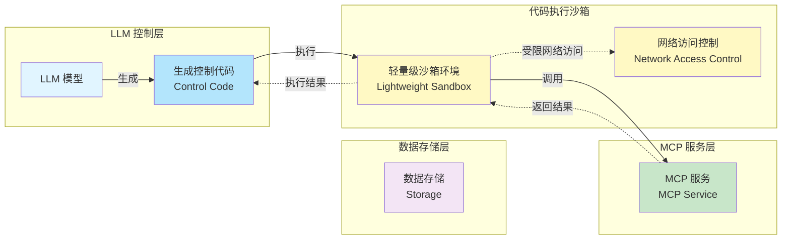

## 1. 背景与问题定义

### 核心挑战

Agent 的工具能力广泛，能解决的问题是广泛的。**<span style="color: red;">当 Agent 解决领域问题涉及大量的工具的拼接组装，且拼接组装的 workflow 是由 LLM 理解和规划的</span>**，我们需要有工具的管理能力和复杂的工具调用组织能力。

**关键挑战**：
- **工具数量庞大**：领域问题往往需要调用数十甚至上百个不同的工具
- **工具组合复杂**：工具之间的调用顺序、依赖关系、并行执行等需要动态规划
- **Workflow 动态生成**：LLM 需要根据问题理解动态生成执行计划
- **工具管理复杂**：不同工具有不同的执行环境、依赖、版本等

### 设计目标

本架构旨在解决以上挑战，提供：
- **灵活的工具编排**：支持 LLM 动态生成和执行复杂的工具调用序列
- **高效的资源管理**：通过沙箱隔离和生命周期管理，优化资源使用
- **可靠的执行环境**：提供安全隔离的代码执行环境
- **可扩展的服务架构**：通过 MCP 协议实现功能代码的服务化

---

## 2. 核心架构概述

### 架构组件

1. **LLM 控制层**
   - 生成控制代码（Control Code）
   - 负责动态组织 tool 的执行流程
   - 实现 LLM 单步可以执行一批 tool

2. **代码执行沙箱**
   - 轻量级执行环境
   - 支持特定网络访问能力
   - 隔离执行环境，确保安全性
   - 快速唤起和代码执行，降低延迟

3. **MCP 服务层**
   - 将功能代码（Functional Code）服务化
   - 提供标准化的服务接口
   - 控制代码通过 MCP 协议调用功能代码服务
   - 功能代码一次编写多次执行，支持独立更新发布
   - 功能代码有复杂的执行环境需求，不适合在轻量级沙箱中部署和执行

4. **数据存储层**
   - 提供数据持久化能力
   - 支持数据的读写访问
   - 为沙箱和 MCP 服务提供数据支持

### 工作流程



#### 架构说明

```
LLM → 生成控制代码 → 沙箱执行控制代码 → 调用 MCP 服务 → 执行功能代码
```

### 关键特性

- **职责分离**：控制逻辑与功能实现分离
- **安全隔离**：沙箱环境限制执行权限
- **网络访问控制**：支持特定网络访问需求
- **服务化架构**：功能代码通过 MCP 协议提供服务

### 设计原则

#### 控制代码与功能代码的职责边界

这是本架构的核心设计原则，决定了 LLM 生成的代码能做什么、不能做什么。

**控制代码的职责**（由 LLM 生成）：
- 动态组织 tool 的执行流程
- 实现 LLM 单步可以执行一批 tool
- 负责编排和决策逻辑（if-else、循环、参数提取）
- **仅允许**：调用预定义的 MCP 工具、基本数据处理、流程控制

**功能代码的职责**（预定义的 MCP 工具）：
- 提供经过安全审计的功能实现
- 处理复杂的执行环境需求（GPU、数据库、外部 API）
- 封装敏感操作（数据库访问、文件操作、网络请求）

**为什么功能代码必须服务化**：
- **安全性**：防止 LLM 生成的代码直接访问敏感资源
- **一次编写多次执行**：功能代码可以复用，避免重复编写
- **独立更新发布**：功能代码可以独立于控制代码进行更新和发布
- **复杂执行环境需求**：功能代码有自己复杂的执行环境需求，不适合在轻量级沙箱中部署
- **沙箱定位**：沙箱更适合轻量级环境以支持快速唤起和代码执行，降低延迟

**边界示例**：

❌ **错误设计**（LLM 代码直接访问敏感资源）：
```python
# LLM 生成的代码 - 危险！
import pymysql
conn = pymysql.connect(host='db.internal', user='root', password='xxx')
conn.execute("DROP TABLE users")  # 灾难性后果
```

✅ **正确设计**（LLM 代码只能调用 MCP 工具）：
```python
# LLM 生成的代码 - 安全
user_id = context.get("user_id")
# 只能调用注册过的安全工具，权限已被限制
result = mcp_call("db_query_tool", {"user_id": user_id})
```

---

## 3. 架构设计说明

### 3.1 控制平面（Control Plane）

控制平面负责系统的调度、治理和服务发现，是整个架构的"大脑"。

#### 3.1.1 生命周期管理

**核心问题**：
- **沙箱创建策略**：沙箱何时创建？是按需创建还是预创建？
- **沙箱销毁策略**：沙箱何时销毁？如何判断沙箱可以回收？
- **资源回收机制**：沙箱销毁后资源如何回收？如何避免资源泄漏？
- **长时间运行处理**：对于长时间运行的 workflow，沙箱如何保持存活？
- **会话管理**：如何管理沙箱会话？会话超时如何处理？

**架构影响**：
- 影响资源使用效率和成本
- 影响系统性能和响应时间
- 影响系统的可维护性
- 决定代码在哪里运行以及运行多久

#### 3.1.2 MCP 服务发现与可扩展性

**核心问题**：
- **服务注册与发现**：MCP 服务如何注册？沙箱如何发现可用的 MCP 服务？
- **服务版本管理**：如何管理 MCP 服务的版本？如何保证向后兼容？
- **负载均衡**：多个 MCP 服务实例如何负载均衡？如何选择最优实例？
- **水平扩展**：如何支持 MCP 服务的水平扩展？扩展时如何保证服务可用性？
- **服务健康检查**：如何检测 MCP 服务的健康状态？不健康的服务如何处理？

**架构影响**：
- 影响系统的可扩展性和可用性
- 影响服务治理能力
- 影响系统的运维复杂度
- 定义沙箱与外界的连接方式

#### 3.1.3 通信协议设计

**核心问题**：
- **协议选择**：LLM → 沙箱 → MCP 服务之间使用什么通信协议？
- **协议标准化**：如何标准化工具调用接口？如何保证不同工具的一致性？
- **数据序列化**：如何高效传输大型数据对象（如文件、数据集）？
- **协议扩展性**：如何支持未来的协议升级和新功能？

**技术选项**：
- **MCP 原生协议**：基于 JSON-RPC over Stdio/SSE，适合 LLM 原生集成
- **HTTP/REST**：简单易用，生态丰富，适合无状态调用
- **gRPC**：高性能，强类型，适合大量数据传输

**架构影响**：
- 影响系统的性能和延迟
- 影响工具生态的扩展性
- 影响跨语言和跨平台能力

---

### 3.2 数据平面（Data Plane）

数据平面负责数据的流转、存储和管理，是整个架构的"记忆系统"。

#### 3.2.1 状态管理与数据流

**核心问题**：
- **控制代码的状态管理**：控制代码在执行过程中如何管理状态？状态是存储在沙箱内还是外部存储？
- **工具间数据传递**：多个工具调用之间的数据如何传递？中间结果如何存储和共享？
- **沙箱状态持久化**：沙箱是否有状态？长时间运行的 workflow 状态如何持久化？
- **数据一致性**：多个工具并发调用时，数据一致性如何保证？
- **上下文管理**：如何管理 LLM 的 Token Window？如何压缩和传递长期记忆？

**架构影响**：
- 影响系统的可扩展性和容错能力
- 影响 workflow 的恢复和重试机制
- 影响系统的性能和资源使用
- 定义业务逻辑的连续性

#### 3.2.2 数据存储架构

**核心问题**：
- **存储类型选择**：不同数据（中间结果、历史记录、缓存）应该使用什么存储类型？
- **数据访问模式**：沙箱和 MCP 服务如何访问存储？是否需要统一的存储接口？
- **数据隔离**：不同租户或任务的数据如何隔离？
- **数据备份与恢复**：重要数据如何备份？如何实现数据恢复？
- **存储性能**：如何优化存储性能？如何平衡成本和性能？

**分层存储策略**：
- **热存储（Redis）**：会话状态、MCP 工具列表、临时变量
- **温存储（S3/MinIO）**：用户上传的文件、生成的图表、执行日志
- **冷存储（PostgreSQL）**：执行记录、审计日志、计费数据

**架构影响**：
- 影响系统性能和可靠性
- 影响数据安全和合规性
- 影响系统成本
- 支撑状态持久化

---

### 3.3 基础设施平面（Infrastructure Plane）

基础设施平面负责运行时环境的配置和资源管理。

#### 3.3.1 网络访问设计

沙箱作为轻量级执行环境，需要严格的网络访问控制：

**最小权限原则**：
- **仅允许访问特定 MCP 服务**：沙箱只能访问已授权的 MCP 服务端点
- **禁止直接访问外部网络**：除非明确授权，否则禁止访问互联网或企业内部网络
- **白名单机制**：基于白名单的访问控制，只允许访问预定义的服务列表

**网络访问场景示例**：
- ✅ **允许**：沙箱 → MCP 服务（通过内部服务发现）
- ✅ **允许**：沙箱 → 数据存储层（如数据库、对象存储、NFS）
- ❌ **禁止**：沙箱 → 互联网（除非明确授权）
- ❌ **禁止**：沙箱 → 其他未授权的内部服务
- ❌ **禁止**：沙箱之间的直接通信

**实现方案**：
- **网络命名空间隔离**：使用 Linux Network Namespace 隔离沙箱网络
- **防火墙规则**：使用 iptables/nftables 限制出站流量
- **云网络策略**：AWS Security Group、Azure NSG、GCP Firewall Rules
- **服务网格**：Istio/Linkerd 实现细粒度的流量控制
- **代理模式**：所有外部请求必须通过授权代理（如 Squid）

---

### 3.4 可靠性工程（Reliability & Operations）

可靠性工程关注系统的健壮性、可观测性和成本效率。

#### 3.4.1 错误处理与容错机制

**核心问题**：
- **MCP 服务失败处理**：当 MCP 服务失败时，控制代码如何感知和处理？是否需要重试机制？
- **部分失败处理**：workflow 中部分工具调用失败，如何决定是继续执行还是回滚？
- **超时策略**：工具调用超时如何处理？超时时间如何设置？
- **故障恢复**：控制代码执行失败后如何恢复？是否需要 checkpoint 机制？
- **降级策略**：当关键服务不可用时，是否有降级方案？
- **自愈机制**：LLM 如何根据错误信息修正代码并重试？

**架构影响**：
- 影响系统的可靠性和可用性
- 影响用户体验和任务完成率
- 影响资源使用效率
- 定义系统的健壮性

#### 3.4.2 监控与可观测性

**核心问题**：
- **Workflow 追踪**：如何追踪整个 workflow 的执行过程？如何构建执行链路？
- **性能监控**：如何监控各组件（LLM、沙箱、MCP 服务）的性能指标？
- **错误追踪**：如何追踪和定位错误？如何分析错误根因？
- **资源监控**：如何监控资源使用情况？如何预测资源需求？
- **业务指标**：如何监控业务指标（如任务完成率、工具调用成功率）？

**全链路追踪**：
- 从用户 Prompt 到 LLM 生成 → 沙箱执行 → MCP 调用 → 结果返回，需要唯一的 `trace_id` 贯穿全流程
- 使用 OpenTelemetry、Jaeger、Zipkin 等分布式追踪系统

**架构影响**：
- 影响问题定位和故障恢复速度
- 影响系统优化和容量规划
- 影响运维效率

#### 3.4.3 成本控制与资源优化

**核心问题**：
- **资源配额管理**：如何为不同任务或租户分配资源配额？
- **成本核算**：如何核算不同组件的使用成本（LLM 调用、沙箱运行、MCP 服务调用）？
- **资源优化**：如何优化资源使用，降低成本？
- **弹性伸缩**：如何根据负载自动调整资源？如何平衡性能和成本？
- **闲置资源回收**：如何检测并回收闲置的沙箱实例？

**成本优化策略**：
- **沙箱池管理**：预热池大小根据负载动态调整
- **按需计费**：基于实际使用时间和资源进行计费
- **资源配额**：为不同租户或任务设置资源上限

**架构影响**：
- 直接影响系统运营成本
- 影响商业模式的可行性
- 影响系统的竞争力


---

---

## 5. 场景演练

### 典型案例：药物研发 Agent

本节通过药物研发 Agent 的完整案例，展示本架构如何支持复杂的多工具协同场景。我们将演示架构的各个组件如何在实际业务中协同工作。

#### 业务背景

药物研发是一个典型的复杂领域问题，涉及多个阶段和大量工具：

**药物研发流程**：
1. **靶点识别**：分析疾病相关基因、蛋白质结构
2. **化合物设计**：基于靶点设计候选化合物
3. **分子模拟**：计算化合物的物理化学性质
4. **ADMET 预测**：预测吸收、分布、代谢、排泄、毒性
5. **合成路线规划**：设计化合物的合成路径
6. **实验验证**：进行体外和体内实验
7. **数据分析**：处理实验数据，评估效果

**工具生态示例**：

**数据查询工具**：
- `query_pubmed`: 查询 PubMed 文献数据库
- `query_chembl`: 查询 ChEMBL 化合物数据库
- `query_pdb`: 查询蛋白质结构数据库
- `query_drugbank`: 查询药物信息数据库

**计算工具**：
- `molecular_docking`: 分子对接计算
- `molecular_dynamics`: 分子动力学模拟
- `quantum_chemistry`: 量子化学计算
- `admet_prediction`: ADMET 性质预测
- `toxicity_prediction`: 毒性预测

**分析工具**：
- `structure_analysis`: 分子结构分析
- `similarity_search`: 相似性搜索
- `clustering`: 化合物聚类分析
- `visualization`: 结果可视化

**实验工具**：
- `synthesis_planning`: 合成路线规划
- `reaction_prediction`: 反应预测
- `experiment_design`: 实验设计
- `data_analysis`: 实验数据分析

#### 架构映射：全链路执行视图

**场景：设计新型抗肿瘤药物**

以下展示架构的各个组件如何在这个场景中协同工作：

1. **LLM 生成控制代码**：
   ```python
   # LLM 生成的动态 workflow
   def discover_anti_tumor_drug():
       # 1. 查询相关靶点
       targets = query_pubmed("cancer target proteins")
       target_protein = select_target(targets)
       
       # 2. 查询已知活性化合物
       active_compounds = query_chembl(target_protein)
       
       # 3. 并行执行多个计算任务
       results = parallel_execute([
           lambda: molecular_docking(target_protein, active_compounds),
           lambda: admet_prediction(active_compounds),
           lambda: toxicity_prediction(active_compounds)
       ])
       
       # 4. 综合分析结果
       candidates = analyze_results(results)
       
       # 5. 设计新化合物
       new_compounds = design_compounds(candidates)
       
       # 6. 验证和优化
       optimized = optimize_compounds(new_compounds)
       
       return optimized
   ```

2. **沙箱执行控制代码**（对应：**生命周期管理**）：
   - 从预热池中获取沙箱实例，启动时间 < 200ms
   - 沙箱保持会话状态，支持多轮代码执行
   - 控制代码动态调用多个 MCP 服务
   - 支持并行调用、条件分支、循环等复杂逻辑

3. **服务发现与调用**（对应：**MCP 服务发现与可扩展性**）：
   - 沙箱通过服务注册中心发现可用的 MCP 服务
   - 负载均衡器选择最优的服务实例
   - 服务健康检查确保调用的服务可用

4. **MCP 服务提供功能代码**（对应：**控制代码与功能代码的职责边界**）：
   - `molecular_docking` 服务：运行在 GPU 集群，需要 CUDA 环境
   - `admet_prediction` 服务：运行在机器学习推理集群
   - `query_pubmed` 服务：连接外部 API，需要网络访问
   - `data_analysis` 服务：需要大数据处理环境

5. **状态与数据管理**（对应：**状态管理与数据流**、**数据存储架构**）：
   - 工具间通过共享存储传递大文件（如化合物数据库）
   - 中间结果存储在对象存储中，通过引用传递
   - 会话状态存储在 Redis 中，支持快速恢复

6. **错误处理**（对应：**错误处理与容错机制**）：
   - 当 `molecular_docking` 超时，自动重试或降级到简化算法
   - 部分工具失败时，LLM 重新规划 workflow
   - 所有错误信息回传给 LLM，支持自愈循环

7. **监控与追踪**（对应：**监控与可观测性**）：
   - 全链路追踪：从用户请求到每个工具调用都有唯一 trace_id
   - 性能监控：记录每个工具的执行时间和资源使用
   - 业务指标：任务完成率、工具调用成功率

#### 架构验证

通过这个案例，我们验证了架构设计的完备性：

- ✅ **灵活的工具组合**：LLM 可以根据问题动态生成工具调用序列
- ✅ **并行执行**：支持同时调用多个工具（分子对接、ADMET预测、毒性预测），提高效率
- ✅ **环境隔离**：不同工具运行在各自适合的环境中（GPU集群、ML推理集群、大数据环境）
- ✅ **快速迭代**：沙箱快速启动（<200ms），支持快速试错和迭代
- ✅ **工具复用**：功能代码一次编写，多次复用
- ✅ **独立更新**：工具可以独立更新，不影响其他组件
- ✅ **健壮性**：错误处理和自愈机制确保系统可靠运行
- ✅ **可观测性**：全链路追踪和监控支持问题定位和优化

## 6. 沙箱实现方案调研 ( draft )

### 6.1 AWS Firecracker

**简介**：AWS Firecracker 是由亚马逊云服务（AWS）开发的开源虚拟机管理器（VMM），专为无服务器计算和容器化工作负载设计。

**核心特性**：
- **快速启动**：microVM 可在 125 毫秒内启动，支持在单台主机上运行数千个实例
- **强安全隔离**：基于 KVM，提供硬件级别的安全隔离，精简的设备模型减少了攻击面
- **内存安全**：使用 Rust 语言开发，从语言层面避免内存安全漏洞
- **轻量级**：结合了容器的启动速度和虚拟机的安全隔离特性

**适用场景**：
- 无服务器计算（Serverless）
- 多租户容器工作负载
- 需要快速启动和高安全性的场景

**官方网站**：https://firecracker-microvm.github.io/

**GitHub**：https://github.com/firecracker-microvm/firecracker

---

### 6.2 E2B

**简介**：E2B（Execution to the Boundary）是一个开源运行时环境，旨在在安全的云沙箱中执行 AI 生成的代码。

**核心特性**：
- **快速启动**：沙箱启动时间小于 200 毫秒，避免冷启动延迟
- **多语言支持**：支持 Python、JavaScript、Ruby、C++ 等多种编程语言
- **安全可靠**：基于 Firecracker 微型虚拟机，确保代码执行的安全性和隔离性
- **私有化部署**：允许用户在 AWS 或 GCP 账户中部署 E2B，实现私有化部署
- **长时间会话**：支持长达 24 小时的会话

**适用场景**：
- AI 生成的代码执行
- 代码评测和在线编程环境
- 需要安全隔离的代码执行场景

**官方网站**：https://e2b.dev/

**GitHub**：https://github.com/e2b-dev/e2b

---

### 6.3 阿里巴巴云方案

#### 6.3.1 阿里云函数计算（Function Compute）

**简介**：阿里云函数计算引入了 FaaSNet 系统，旨在加速自定义无服务器容器运行时的部署。

**核心特性**：
- **快速部署**：FaaSNet 通过轻量级、自适应的函数树结构，实现了大规模容器的快速部署
- **高性能**：评估结果显示，FaaSNet 能在 8.3 秒内在 1000 台虚拟机上部署 2500 个函数容器
- **可扩展性**：适用于需要高弹性和快速扩展的无服务器平台

**适用场景**：
- 无服务器函数计算
- 大规模容器部署
- 需要快速扩展的场景

**官方网站**：https://www.alibabacloud.com/product/function-compute

**相关论文**：FaaSNet - Scalable Middleware for Accelerating FaaS Container Supply (arXiv:2105.11229)

#### 6.3.2 阿里云安全容器服务

**简介**：阿里云提供的安全容器服务，提供轻量级沙箱环境用于运行应用程序。

**核心特性**：
- 强调安全性和效率
- 适用于需要快速扩展和隔离的场景
- 提供轻量级沙箱环境

**官方网站**：https://www.alibabacloud.com/product/secure-container-service

---

### 6.4 字节跳动方案

#### 6.4.1 SandboxFusion

**简介**：字节跳动开源的安全沙箱，支持多种编程语言的代码运行和评测。

**核心特性**：
- **多语言支持**：支持 Python、C++、Go、Java 等多种编程语言
- **安全隔离**：提供安全的代码执行环境
- **代码评测**：适用于在线编程和代码评测场景

**适用场景**：
- 在线编程平台
- 代码评测系统
- 需要安全执行用户代码的场景

**GitHub**：https://github.com/bytedance/SandboxFusion

#### 6.4.2 FunLess

**简介**：为私有边缘云系统设计的 FaaS 平台，利用 WebAssembly 作为运行时环境。

**核心特性**：
- **轻量级**：提供轻量级、沙盒化的运行环境
- **WebAssembly**：利用 WebAssembly 作为运行时环境
- **边缘计算**：适用于资源受限的边缘设备

**适用场景**：
- 边缘计算场景
- 资源受限的设备
- 需要轻量级运行时的 FaaS 平台

**相关论文**：FunLess: A Serverless FaaS Platform for Private Edge Clouds (arXiv:2405.21009)

#### 6.4.3 火山引擎 AI 密态计算（AICC）

**简介**：火山引擎提供的 AI 密态计算技术，旨在保障 AI 应用的数据安全。

**核心特性**：
- **机密部署**：支持"机密部署"方式，一键开启各种模型的机密推理服务
- **数据安全**：实现对内部机密知识库的安全保护
- **成本优化**：降低部署成本

**适用场景**：
- AI 模型推理服务
- 需要数据安全保护的场景
- 机密计算场景

**官方网站**：https://www.volcengine.com/

---

### 6.5 方案对比总结

| 方案 | 启动时间 | 隔离级别 | 适用场景 | 开源状态 |
|------|---------|---------|---------|---------|
| AWS Firecracker | ~125ms | 硬件级（KVM） | 无服务器、多租户容器 | 开源 |
| E2B | <200ms | 硬件级（基于 Firecracker） | AI 代码执行、代码评测 | 开源 |
| 阿里云 FaaSNet | 秒级 | 容器级 | 大规模函数计算 | 部分开源 |
| SandboxFusion | - | 进程级 | 代码评测、在线编程 | 开源 |
| FunLess | - | WebAssembly | 边缘计算、FaaS | 部分开源 |

**选择建议**：
- **需要硬件级隔离和快速启动**：AWS Firecracker 或 E2B
- **AI 代码执行场景**：E2B（专为 AI 生成代码设计）
- **大规模函数计算**：阿里云 FaaSNet
- **代码评测平台**：SandboxFusion
- **边缘计算场景**：FunLess（WebAssembly）


---

## 7. 安全与性能

### 7.1 防止控制代码滥用 MCP 服务

防止控制代码滥用 MCP 服务需要从认证、授权、限流、监控等多个维度进行防护。

#### 7.1.1 认证与授权

**身份认证**：
- **API Key 认证**：为每个沙箱分配唯一的 API Key
- **JWT Token**：使用 JWT Token 进行身份验证
- **mTLS（双向 TLS）**：使用客户端证书进行身份验证
- **OAuth 2.0**：支持标准的 OAuth 2.0 认证流程

**授权机制**：
- **RBAC（基于角色的访问控制）**：为不同角色分配不同的权限
- **ABAC（基于属性的访问控制）**：基于沙箱属性进行权限控制
- **最小权限原则**：只授予必要的权限
- **权限动态调整**：根据任务需求动态调整权限

**实现示例**：
```yaml
# 沙箱权限配置示例
sandbox_permissions:
  - sandbox_id: "sandbox-001"
    allowed_tools:
      - "molecular_docking"
      - "admet_prediction"
    rate_limit:
      requests_per_minute: 100
    resource_quota:
      max_execution_time: 300s
      max_memory: "1GB"
```

#### 7.1.2 限流与配额

**限流策略**：

**1. 请求频率限制（Rate Limiting）**：
- **固定窗口**：固定时间窗口内的请求数限制
- **滑动窗口**：滑动时间窗口内的请求数限制
- **令牌桶**：基于令牌桶算法的限流
- **漏桶**：基于漏桶算法的限流

**2. 配额管理**：
- **每日配额**：限制每日调用次数
- **资源配额**：限制资源使用量（CPU、内存、存储）
- **成本配额**：限制调用成本（如 GPU 使用时间）

**实现技术**：
- **Redis + Lua**：使用 Redis 实现分布式限流
- **Envoy Rate Limiting**：使用 Envoy 代理实现限流
- **Kong API Gateway**：使用 Kong 实现 API 限流
- **Istio Rate Limiting**：使用 Istio 服务网格实现限流

**限流示例**：
```python
# 令牌桶限流示例
from redis import Redis
import time

class RateLimiter:
    def __init__(self, redis_client, key, rate, capacity):
        self.redis = redis_client
        self.key = key
        self.rate = rate  # 每秒补充的令牌数
        self.capacity = capacity  # 桶容量
    
    def acquire(self):
        now = time.time()
        # 使用 Redis 实现令牌桶算法
        # ...
```

#### 7.1.3 请求验证与过滤

**输入验证**：
- **参数校验**：验证请求参数的合法性
- **大小限制**：限制请求体大小
- **类型检查**：验证参数类型和格式
- **恶意代码检测**：检测和过滤恶意代码片段

**请求过滤**：
- **黑名单过滤**：过滤已知的恶意请求模式
- **白名单验证**：只允许预定义的安全操作
- **行为分析**：分析请求行为模式，识别异常

#### 7.1.4 监控与审计

**实时监控**：
- **调用频率监控**：实时监控每个沙箱的调用频率
- **资源使用监控**：监控资源使用情况
- **异常检测**：自动检测异常调用模式

**审计日志**：
- **调用日志**：记录所有 MCP 服务调用
- **访问日志**：记录访问时间和来源
- **错误日志**：记录错误和异常情况
- **安全事件日志**：记录安全相关事件

**告警机制**：
- **频率告警**：调用频率异常时告警
- **资源告警**：资源使用超限时告警
- **安全告警**：检测到安全威胁时告警

#### 7.1.5 防护策略示例

**多层防护架构**：
```
┌─────────────────────────────────┐
│   沙箱（控制代码）                │
└──────────────┬──────────────────┘
               │
┌──────────────▼──────────────────┐
│   认证网关                        │
│   (API Key、JWT、mTLS)           │
└──────────────┬──────────────────┘
               │
┌──────────────▼──────────────────┐
│   限流网关                        │
│   (Rate Limiting、Quota)         │
└──────────────┬──────────────────┘
               │
┌──────────────▼──────────────────┐
│   请求验证                        │
│   (参数校验、恶意检测)            │
└──────────────┬──────────────────┘
               │
┌──────────────▼──────────────────┐
│   MCP 服务                        │
│   (功能代码执行)                  │
└─────────────────────────────────┘
```

---

### 7.2 性能优化考虑

性能优化需要从启动时间、执行效率、资源利用率等多个维度进行优化。

#### 7.2.1 冷启动优化

**问题**：沙箱冷启动会导致延迟增加，影响用户体验。

**优化策略**：

**1. 预热机制（Warm-up）**：
- **预创建沙箱**：提前创建一定数量的沙箱实例
- **保持活跃连接**：保持与 MCP 服务的连接池
- **预加载资源**：提前加载常用资源

**2. 快速启动技术**：
- **轻量级沙箱**：使用 Firecracker、gVisor 等轻量级方案
- **镜像优化**：精简镜像大小，减少启动时间
- **延迟加载**：按需加载非关键组件

**3. 沙箱复用**：
- **会话保持**：保持沙箱会话，避免频繁创建销毁
- **连接复用**：复用网络连接和资源
- **状态缓存**：缓存常用状态，减少初始化时间

**性能指标**：
- **冷启动时间**：< 200ms（目标）
- **热启动时间**：< 50ms（目标）
- **预热池大小**：根据负载动态调整

#### 7.2.2 执行效率优化

**并行执行**：
- **工具并行调用**：同时调用多个独立的工具
- **批处理优化**：批量处理请求，减少网络开销
- **异步执行**：使用异步 I/O，提高并发能力

**缓存策略**：
- **结果缓存**：缓存工具调用结果，避免重复计算
- **资源缓存**：缓存常用资源，减少加载时间
- **智能缓存**：基于访问模式智能缓存

**代码优化**：
- **代码预编译**：预编译常用代码片段
- **JIT 编译**：使用即时编译优化执行
- **代码分析**：静态分析优化代码执行路径

#### 7.2.3 资源利用率优化

**资源调度**：
- **智能调度**：根据任务类型智能调度资源
- **资源池化**：共享资源池，提高利用率
- **弹性扩缩容**：根据负载自动扩缩容

**资源复用**：
- **连接池**：复用数据库、网络连接
- **对象池**：复用对象实例，减少创建开销
- **内存池**：复用内存分配，减少内存碎片

#### 7.2.4 网络性能优化

**协议优化**：
- **HTTP/2**：使用 HTTP/2 多路复用
- **gRPC**：高性能场景使用 gRPC
- **压缩**：启用请求/响应压缩

**连接优化**：
- **连接复用**：复用 TCP 连接
- **连接池**：维护连接池，减少连接建立时间
- **Keep-Alive**：保持长连接，减少握手开销

#### 7.2.5 监控与调优

**性能监控**：
- **延迟监控**：监控请求延迟（P50、P95、P99）
- **吞吐量监控**：监控系统吞吐量
- **资源监控**：监控 CPU、内存、网络使用率

**性能分析**：
- **性能剖析**：使用 profiling 工具分析性能瓶颈
- **分布式追踪**：使用分布式追踪系统（如 Jaeger、Zipkin）
- **日志分析**：分析日志找出性能问题

**持续优化**：
- **A/B 测试**：测试不同优化方案的效果
- **性能基准测试**：建立性能基准，持续改进
- **容量规划**：根据性能指标进行容量规划

#### 7.2.6 性能优化最佳实践

**分层优化策略**：
```
应用层优化：
  - 代码优化、算法优化
  - 并行执行、异步处理
  
沙箱层优化：
  - 快速启动、资源复用
  - 连接池、缓存策略
  
基础设施层优化：
  - 资源调度、负载均衡
  - 网络优化、存储优化
```

**性能目标**：
- **启动时间**：冷启动 < 200ms，热启动 < 50ms
- **执行延迟**：P95 延迟 < 100ms
- **吞吐量**：支持每秒数千次工具调用
- **资源利用率**：CPU 利用率 > 70%，内存利用率 > 80%
