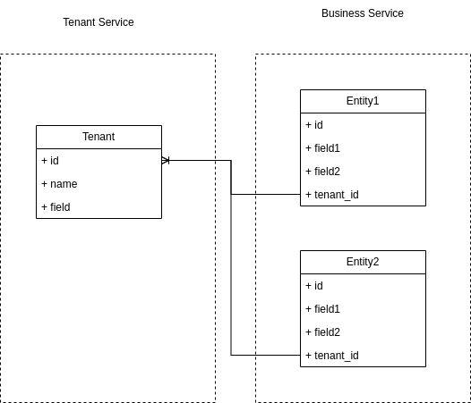

> 本篇是关于多租户应用与架构设计关注点的一些自己的思考。本篇强调多租户本质是支持共享与隔离。同时提到应用架构可能的形式以及多租户集成的设计。核心的关注点强调了对业务未来长期的判断决定了隔离粒度，最终决定了业务应用的产品架构与技术架构设计。 本篇更多是提供一些启发，供商业规划、业务负责人、技术解决方案提供方在做多租户集成时，进行参考。本篇不作为多租户服务提供者的设计建议。

# 什么是多租户

多租户是一种实现资源共享与隔离的架构。

## 一、共享

**用户不可直接触达的资源必然是共享。**

- 共享是为降本增效，最重要还是为了增效。
- 计算资源有效运行时间
- 存储空间有效利用
- 降低应用维护、多集群维护、观测系统搭建、维护人员投入等成本

有的服务可能不允许共享

- 数据安全考虑，要求强隔离，比如独立的存储、独立的数据库、独立的计算集群、网络访问限制只允许在一个孤岛中计算
- 私有化部署，所有组件都在自己的运行环境中 这种情况下，多租户的解决方案要解决的问题并不存在。

> **可以这么说，如果没有共享资源的需求和架构设计，完全不需要应用多租户。**

## 二、隔离

**共享架构下，用户访问需要一个逻辑隔离的环境。**

- 计算资源隔离：集群配额，计算资源使用优先级，独占集群，用户自主提供的集群
- 存储资源隔离：逻辑路径(Unix路径)/逻辑库/逻辑服务，存储服务使用不互相干扰（某个租户大量请求造成存储服务触及峰值不影响其他租户使用），
- 网络资源隔离：带宽使用

# 核心关注点

## 一、SAAS 尽早做多租户设计规划

越早规划，越早预留扩展能力。

一旦自研服务设计不合适，业务逻辑耦合了应用内部的用户和权限，后期只能被当做第三方服务接入。这种情形下隔离和共享难支持，可能会被迫为每个租户提供单独的部署与维护支持。

## 二、隔离粒度是一个复杂点，跟业务发展息息相关，由业务预估和方向判断决定

隔离粒度决定了用户看到的资源是什么样的。

举例来讲，一个果园由多个人承包，按地隔离，拥有者就会盯着土地划界；按拥有多少果树隔离，拥有者就会算着自己的果树；按产出的斤两隔离，拥有者只会盯着最后的果实。

所以隔离粒度，是业务决定的，是商业模式销售模式决定的，最终由技术架构实现支持。 技术架构往往落地之后会运行相当一段时间。隔离粒度的决策，需要对长期的业务发展方向进行评估。

## 三、Access 层是核心处理多租户信息的组件，Business 层是对多租户的实现

当你已经意识到并且早早地开始做多租户设计，当你已经对隔离粒度有一个比较明确的方向判断，就要开始对分层做设计和实现了。 最基本的设计是两层，

- Access 层负责支持验证和访问控制，生成 tenant 的 info 信息。
- Business 层只依赖 tenant_id，不做其他的耦合。

# 补充关注点

## 一、微服务架构下，访问各个服务与资源的方式

1. 直接访问
2. Access 层会申请访问需要的资源的 `access_token`
3. 租户会分配到一个 `tenant_id` 并携带一些 metadata 信息, `OIDC` 协议的 `token` 可以解析出来

4. 代理租户访问资源与服务

这种模式相当于有一个agent，负责带着租户去访问各种资源，本质上还是租户自己在访问。同时，这种模式要求 agent 有自己的认证与访问控制判断实现，并且可以联通租户管理系统执行租户的验证。

- agent由于取得了资源代理人的资格，得到了服务提供者的信任，也拥有足够的权限，可以直接访问一部分资源，减少一些鉴权工作。
- 对于部分安全要求高的资源访问，仍然需要校验租户的权限，形式可能从`access_token`中解析，也可能拿着 `tenant_id` 去租户中心校验
- 租户只是一个标签

  - 强化 agent 的能力，弱化 tenant 的能力。
  - agent 相当于拿着一个 tenant_id 标识走一遍整个服务，并对资源访问做标签操作。 这时候的 agent 可以不理会 tenant 的任何实现。
  - 要求 agent 对 tenant 有极高的信任；
  - 要求访问的服务支持 agent 访问

## 二、多租户服务提供者可能需要提供什么

1. 用户、用户组多级管理
2. 支持虚拟用户、用户灵活分组。
3. 支持将组当做一个租户
4. 支持一个真实用户可以拥有多个不同的租户身份
5. 强大的配置能力 支持业务应用将各类权限数据灵活的配置到多租户服务提供者上

所以在做选型的时候，需要一并评估业务对多租户服务提供者长周期扩展能力的需求，以最终决定选用什么服务。
