<div style="color: #666; font-style: italic; font-size: 0.9em; margin-bottom: 1em;">
本文内容由 AI 协助生成，并基于公开官方文档、安全指南和工程架构资料整理。文中的架构建议是对这些资料的综合推导，不代表任何单一厂商的内部实现或完整安全承诺。
</div>

## 一、核心结论

在 SaaS Agent 场景里，Sandbox 不应该被理解成“一个能运行代码的容器”。更准确地说：容器、microVM、托管代码解释器、云浏览器都可能是 sandbox 的实现方式；但产品真正需要的是一个受控的执行边界。OpenAI Code Interpreter、E2B、CubeSandbox 等文档都把 sandbox 放在“隔离执行环境”的语境下，但 OWASP AI Agent Security 进一步提醒，Agent 风险来自工具滥用、权限扩大、数据外泄和目标劫持，因此仅有执行隔离还不够。[OpenAI/E2B/CubeSandbox：sandbox 用于隔离代码执行和文件处理](#ref-16)；[OWASP AI Agent Security：least privilege、HITL、tool abuse 风险](#ref-18)

更准确的理解是：

> Sandbox 是 Agent 执行动作的隔离现场。[OpenAI/E2B/CubeSandbox：sandbox 用于隔离代码执行和文件处理](#ref-16)；[OWASP AI Agent Security：least privilege、HITL、tool abuse 风险](#ref-18)；[OWASP Secure Coding with AI：工具权限、输入校验、不可信上下文](#ref-20)

它的价值不在于“用了什么虚拟化技术”，而在于帮产品回答这几个问题：

- Agent 在哪里执行代码？
- Agent 在哪里读写文件？
- Agent 在哪里打开浏览器？
- Agent 能不能访问外网？
- Agent 能不能拿到客户凭证？
- Agent 的中间产物放在哪里？
- Agent 中断后怎么恢复？
- Agent 的危险动作怎么审批？

所以 SaaS Agent 使用 Sandbox 的正确方式不是：

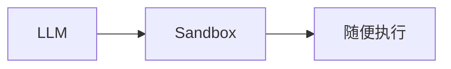

而是：

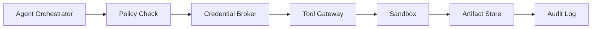

一句话：

> Agent 可以自由思考，但不能自由行动。所有行动都要经过策略、凭证、网络、配额和审计边界。[OWASP AI Agent Security：least privilege、HITL、tool abuse 风险](#ref-18)；[OWASP Secure Coding with AI：工具权限、输入校验、不可信上下文](#ref-20)；[Google Cloud Agent Identity：auth manager / credential vault 管理凭证](#ref-21)；[OWASP SSRF Prevention：allowlist、阻断内网和 metadata endpoint](#ref-22)；[Cloudflare HITL：workflow 暂停等待人工确认](#ref-24)

### 本文的威胁模型

本文讨论的 Sandbox 不是为了防一个单一风险，而是为了同时约束几类不可信输入和副作用：

- LLM 生成的代码、Shell、SQL、浏览器动作；
- 用户上传的文件、压缩包、表格、脚本和仓库；
- 第三方网页、邮件、文档里的 prompt injection；
- sandbox 内代码对网络、内网、metadata endpoint、第三方 API 的访问；
- 客户 OAuth token、API key、cookie、浏览器登录态等敏感凭证；
- 跨租户数据残留、workspace 复用、snapshot 恢复带来的隔离风险；
- 发邮件、提交表单、付款、删除数据、创建 PR 等外部副作用；
- sandbox provider、基础镜像、依赖包和运行时本身的供应链风险。

所以本文后面的建议，都是围绕这几个风险建立控制面：哪些动作能执行、在哪里执行、用什么凭证、能访问什么网络、产物怎么流出、失败后如何恢复、危险动作何时需要人类确认。

---

## 二、什么时候需要 Sandbox

不是所有 Agent 都需要复杂 Sandbox。判断标准很简单：

> 只要 Agent 要执行不可信、可变、带副作用的动作，就应该进入 Sandbox 或经过等价的隔离执行层。[OpenAI/E2B/CubeSandbox：sandbox 用于隔离代码执行和文件处理](#ref-16)；[OWASP AI Agent Security：least privilege、HITL、tool abuse 风险](#ref-18)；[OWASP Prompt Injection：网页/文档/邮件可成为注入载体](#ref-19)；[OWASP Secure Coding with AI：工具权限、输入校验、不可信上下文](#ref-20)

### 需要 Sandbox 的场景

典型场景包括：

- 执行 LLM 生成的代码；
- 运行 Python / JavaScript / Shell；
- 处理用户上传文件；
- 修改 repository；
- 运行测试；
- 打开浏览器访问第三方网站；
- 下载或上传文件；
- 生成图表、报告、CSV、PDF；
- 执行多步骤自动化任务；
- 为每个租户创建隔离工作区。

### 不一定需要 Sandbox 的场景

如果 Agent 只是：

- 读数据库里已经授权的数据；
- 调一个固定后端 API；
- 做只读问答；
- 生成文本草稿；
- 调用没有副作用的内部函数；

那么不一定要上完整 Sandbox，但仍然要有 tool gateway、权限控制和审计。这个判断来自 OWASP 对 Agent least privilege、tool abuse 和 monitoring 的要求：即使没有代码执行环境，工具调用本身仍然是安全边界。[OWASP AI Agent Security：least privilege、HITL、tool abuse 风险](#ref-18)；[OWASP Secure Coding with AI：工具权限、输入校验、不可信上下文](#ref-20)

---

## 三、Sandbox 在产品里的位置

Sandbox 不应该直接暴露给 LLM。它应该由 Orchestrator 管理。原因是 Agent 工具调用需要按用户权限、会话上下文和最小权限校验，而凭证、网络和审计也需要由外部控制面统一管理。[OWASP AI Agent Security：least privilege、HITL、tool abuse 风险](#ref-18)；[OWASP Secure Coding with AI：工具权限、输入校验、不可信上下文](#ref-20)；[Google Cloud Agent Identity：auth manager / credential vault 管理凭证](#ref-21)；[OWASP SSRF Prevention：allowlist、阻断内网和 metadata endpoint](#ref-22)

推荐结构：

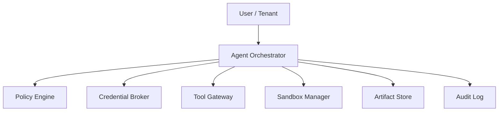

### Orchestrator 负责什么

Orchestrator 负责：

- 创建 sandbox；
- 绑定 tenant / session / task；
- 注入最小必要上下文；
- 调用工具；
- 保存结果；
- 记录事件；
- 在失败后恢复任务。

LLM 不应该直接知道底层 sandbox 的 root credential、主机网络、存储路径或云资源权限。Google Cloud Agent Identity（当前相关能力包含预览特性）给出的模式是通过身份、auth manager / credential vault 发放受控凭证，而不是把原始 secret 暴露给 Agent。[Google Cloud Agent Identity：auth manager / credential vault 管理凭证](#ref-21)

### Sandbox 负责什么

Sandbox 只负责“执行现场”：

- 运行代码；
- 读写临时文件；
- 打开浏览器；
- 运行测试；
- 生成中间产物；
- 暂存执行上下文。

Sandbox 不应该负责最终权限判断，也不应该负责长期保存业务数据。权限判断属于 tool permission / policy 层，业务产物应通过受控文件接口或 artifact store 流出，而不是依赖 sandbox 内部目录长期保存。[OWASP Secure Coding with AI：工具权限、输入校验、不可信上下文](#ref-20)；[OpenAI Code Interpreter / E2B：文件进出 sandbox 与产物处理](#ref-26)

---

## 四、一次 Agent 任务应该怎么使用 Sandbox

一个比较稳的执行流程是：先把执行放入隔离环境，再让外部动作经过 tool gateway、credential broker、approval 和 audit。这是对代码执行模型、OWASP Agent 安全建议、受控身份、HITL 和 workflow/audit 思路的组合设计；不是任何单一厂商文档直接给出的完整架构。[OpenAI/E2B/CubeSandbox：sandbox 用于隔离代码执行和文件处理](#ref-16)；[OWASP AI Agent Security：least privilege、HITL、tool abuse 风险](#ref-18)；[Google Cloud Agent Identity：auth manager / credential vault 管理凭证](#ref-21)；[Cloudflare HITL：workflow 暂停等待人工确认](#ref-24)

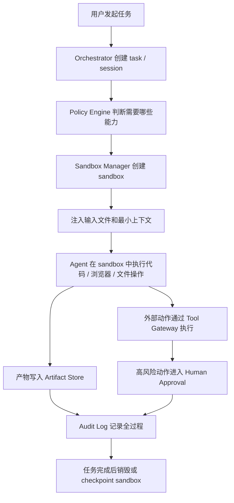

这里有一个关键原则：

> Sandbox 里的结果不能自动变成真实世界的结果。[OWASP Secure Coding with AI：工具权限、输入校验、不可信上下文](#ref-20)；[Cloudflare HITL：workflow 暂停等待人工确认](#ref-24)；[OpenAI Code Interpreter / E2B：文件进出 sandbox 与产物处理](#ref-26)

例如 coding agent 修改了代码，正确流程应该是：

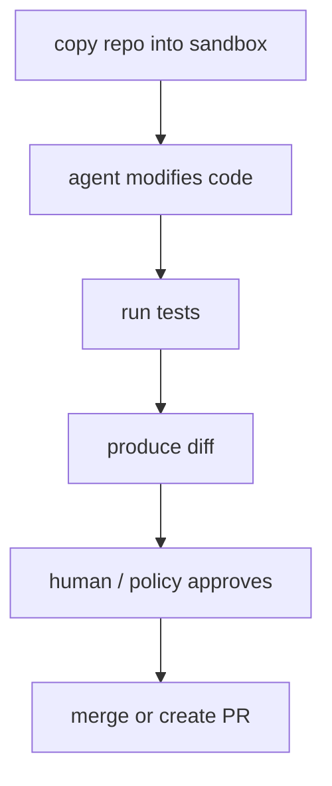

而不是让 Agent 直接改生产仓库。

---

## 五、Sandbox 生命周期怎么设计

Sandbox 的生命周期建议分三种。这个分层来自两个事实：一方面 E2B 等 sandbox 支持按需创建、暂停、恢复；另一方面 AWS Lambda 执行环境生命周期说明运行环境复用会保留 `/tmp`、进程内对象等状态，因此生命周期越长，状态和残留风险越需要显式管理。[AWS Lambda Execution Lifecycle：复用会保留 /tmp 与进程内状态](#ref-3)；[E2B Sandbox：按需创建、暂停、恢复 sandbox](#ref-15)

### 1. 短任务 Sandbox

适合：

- 文件转换；
- 数据分析；
- 运行一段代码；
- 生成图表；
- 一次性网页抓取；
- 简单测试。

策略：

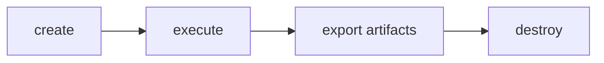

这是默认模式，最安全、最容易控成本。设计依据是：短任务只把输入、输出和日志作为 artifact 保留，避免把执行环境本身变成长期状态源。AWS Lambda 执行环境复用会保留 `/tmp`、全局对象和后台进程，这里只是用作“复用会残留状态”的类比；OpenAI Code Interpreter / E2B 的文件进出能力则说明产物需要通过受控接口流出。[AWS Lambda Execution Lifecycle：复用会保留 /tmp 与进程内状态](#ref-3)；[OpenAI Code Interpreter / E2B：文件进出 sandbox 与产物处理](#ref-26)

### 2. 会话级 Sandbox

适合：

- 多轮数据分析；
- notebook-like 工作流；
- 需要保留上下文的 browser session；
- 用户和 Agent 交互式协作。

策略：

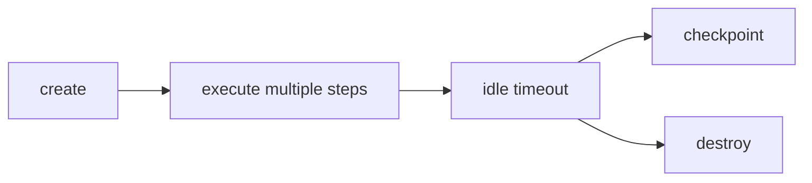

注意：会话级 sandbox 必须有 idle timeout，不能无限保留。Browserbase 和 E2B 都有 session / sandbox 生命周期能力，但这类能力应和配额、超时、回收策略一起设计，而不是默认长驻。[E2B Sandbox：按需创建、暂停、恢复 sandbox](#ref-15)；[Browserbase：云浏览器 session、录制、timeout 与 keep-alive](#ref-17)

### 3. 项目级 Workspace

适合：

- coding agent；
- 长期项目；
- repository 修改；
- 多天任务；
- 复杂调试。

策略：

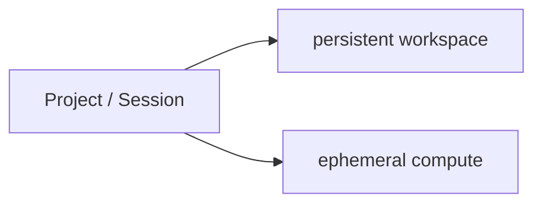

也就是 workspace 可以保留，但执行 sandbox 可以重建。不要把“项目状态”完全绑定到一个永不销毁的运行容器上；durable workflow / workflow history 的设计思路也是把长期状态放到外部 durable layer，而不是依赖某个 worker 或 sandbox 内存。[Cloudflare Workflows：durable workflow、history、幂等恢复](#ref-25)

---

## 六、持续运行 Agent：状态怎么保持

持续运行 Agent 最大的问题是：中间一定会断。Cloudflare Workflows 这类 durable workflow 的思路是把长任务建模为可恢复的 workflow/history，而不是依赖一次连续不失败的进程执行。[Cloudflare Workflows：durable workflow、history、幂等恢复](#ref-25)

可能断在：

- LLM 调用失败；
- sandbox 被回收；
- 浏览器崩溃；
- worker 重启；
- 网络超时；
- 用户暂停；
- 审批等待；
- 任务超过执行时间。

所以不能依赖“一个一直活着的 sandbox”。正确做法是把状态拆开保存：Agent 控制状态进入 workflow/state store，执行产物进入 artifact/workspace，外部副作用进入 operation log。这是对 durable workflow、云浏览器会话记录和 sandbox 文件流转能力的组合推导。[Cloudflare Workflows：durable workflow、history、幂等恢复](#ref-25)；[Browserbase：云浏览器 session、录制、timeout 与 keep-alive](#ref-17)；[OpenAI Code Interpreter / E2B：文件进出 sandbox 与产物处理](#ref-26)

### 三类状态

#### 1. Agent 控制状态

包括：

- task id；
- tenant id；
- 当前计划；
- 已完成步骤；
- 下一步 cursor；
- tool call history；
- approval 状态；
- retry count；
- 错误信息。

这些应该存在 Agent State Store 或 workflow engine 中。Cloudflare Workflows 文档强调 workflow runtime 会保存执行历史/状态，用于恢复和继续执行。[Cloudflare Workflows：durable workflow、history、幂等恢复](#ref-25)

#### 2. Sandbox 执行状态

包括：

- 工作目录；
- 生成文件；
- 安装依赖；
- notebook kernel；
- browser profile；
- screenshots；
- stdout / stderr。

这些可以通过 artifact、workspace volume、snapshot 或 checkpoint 保存。E2B 的 sandbox 文档和 Firecracker snapshot 文档分别提供了 sandbox pause/resume 与底层 snapshot/restore 的参考，但它们都应服务于上层生命周期策略。[Firecracker Snapshot / Jailer：snapshot 恢复与隔离增强](#ref-13)；[E2B Sandbox：按需创建、暂停、恢复 sandbox](#ref-15)

##### Snapshot / Checkpoint 到底应该保存什么

Snapshot 不是“把整个 sandbox 当成数据库”。它更像是一个可恢复的执行现场，用来缩短恢复时间、保留运行上下文，或者从同一个干净基线恢复出新的执行分支。不同平台的 pause/resume、snapshot、checkpoint 语义并不等价，不能把 E2B persistence、Firecracker snapshot 和 Docker checkpoint 混成同一种能力。[E2B Persistence / Auto-resume：pause/resume 保留运行状态](#ref-31)；[E2B / Firecracker Snapshot：point-in-time 状态恢复和 fork](#ref-32)

推荐把 snapshot 拆成几层：

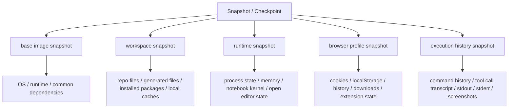

这几层不要混在一起保存。原因是它们的生命周期、敏感度和复用边界都不同：

| 内容 | 是否适合 snapshot | 更推荐的位置 |
|---|---|---|
| 基础镜像、语言运行时、常用依赖 | 适合 | base image / golden snapshot |
| 当前 workspace 文件、临时 repo、生成文件 | 适合 | workspace volume / object store / diff |
| notebook kernel、长任务进程、内存中间结果 | 有条件适合 | runtime snapshot / pause-resume |
| browser profile、cookies、localStorage、下载记录 | 只适合同租户/同 session | encrypted profile store |
| 命令历史、stdout/stderr、截图、tool trace | 适合保存，但不一定放进 sandbox snapshot | audit log / execution log / artifact store |
| 用户上传的原始文件 | 不建议只存在 snapshot 里 | user file store / artifact store |
| 长期 secret、OAuth refresh token、客户 API key | 不应该 | credential broker / secret vault |
| 已经发生的外部动作 | 不应该 | operation log / idempotency store |

也就是说，snapshot 可以包含“运行现场”，但不应该成为唯一事实来源。尤其是用户数据要单独建模：用户上传文件、浏览器登录态、生成产物、审计日志和业务数据库记录，不应该因为恢复一个 sandbox snapshot 就被隐式恢复或覆盖。

一个更稳的保存模型是：

```text
checkpoint_id
tenant_id
user_id
session_id
task_id
run_id
base_image_digest
workspace_version
runtime_snapshot_ref
browser_profile_ref
artifact_refs
execution_log_range
created_at
expires_at
encryption_key_ref
data_classification
restore_policy
```

恢复时不要只做：

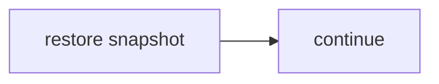

更安全的流程是：

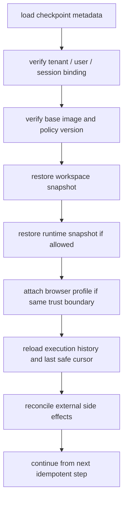

这里有几个容易踩坑的点：

- snapshot 可能保存内存里的 token、shell history、浏览器 cookie，所以 snapshot 本身必须按敏感数据加密、隔离、设置 TTL；
- runtime snapshot 可能包含打开的 socket、后台进程和依赖宿主机的状态，恢复后要做健康检查，不能假设所有连接还有效；[Firecracker Snapshot Caveats：恢复依赖宿主条件和健康检查](#ref-33)；[Docker checkpoint / CRIU：checkpoint 的一致性风险](#ref-34)
- browser profile 是用户数据，不是普通缓存；Playwright / Chromium 的 user data directory 会包含 cookie、localStorage、history 等登录态和浏览痕迹；[Playwright Persistent Context：userDataDir 保存浏览器会话状态](#ref-35)；[Chromium User Data Directory：cookies/history/local state 等用户数据](#ref-36)
- 跨 tenant 默认不要复用同一个 runtime snapshot；如果要用基础镜像 snapshot 加速启动，也应该只复用无用户数据、无凭证、无历史状态的 clean snapshot；
- audit log 和 operation log 必须外置，因为它们是判断“上一步到底有没有对外生效”的依据，不能跟着 sandbox 回滚。

一句话：

> Snapshot 用来恢复执行现场，不用来保存业务事实；用户数据、凭证和外部副作用必须有独立的系统记录。

#### 3. 外部副作用状态

包括：

- 是否已经发邮件；
- 是否已经提交表单；
- 是否已经创建订单；
- 是否已经写数据库；
- 是否已经创建 PR。

这些不能靠 sandbox 恢复，必须靠 operation log 和 idempotency key 管理。因为外部副作用已经发生在 sandbox 之外，恢复时首先要 reconcile，而不是盲目 replay。[Cloudflare Workflows：durable workflow、history、幂等恢复](#ref-25)

### 推荐恢复流程

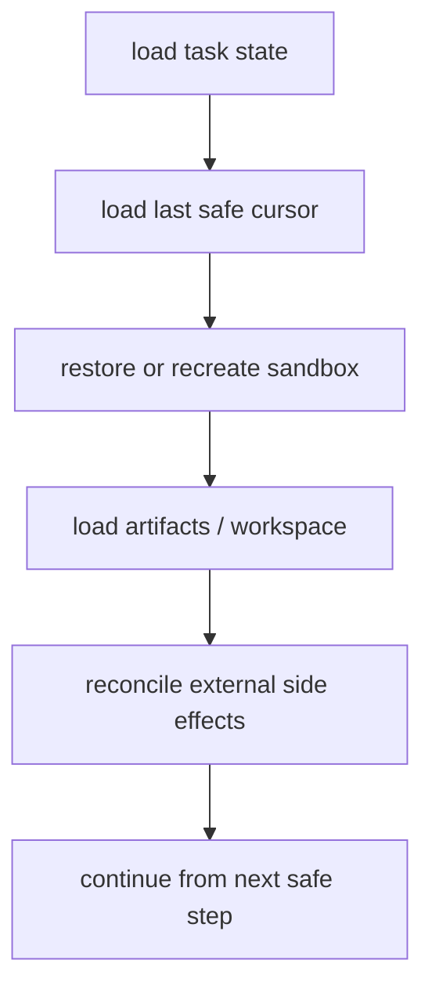

关键原则：

```text
Sandbox can be durable,
but recovery must not depend on sandbox immortality.
```

也就是：sandbox 可以长时间存在，但系统必须能在它消失后恢复。

---

## 七、工具和凭证怎么接入 Sandbox

这是 SaaS Agent 最容易做错的部分。OWASP AI Agent Security 和 Secure Coding with AI 都把 tool permissions、least privilege、输入校验和不可信上下文视为核心风险点。[OWASP AI Agent Security：least privilege、HITL、tool abuse 风险](#ref-18)；[OWASP Secure Coding with AI：工具权限、输入校验、不可信上下文](#ref-20)

### 不要把长期 Secret 放进 Sandbox

错误做法：

```text
export CUSTOMER_API_KEY=xxx
```

更好的做法：

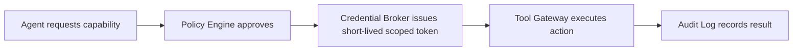

Agent 不应该直接持有客户长期凭证。Sandbox 也不应该变成 secret 仓库。Google Cloud Agent Identity 文档给出的设计是把凭证交给 auth manager / credential vault，并让 Agent 使用绑定身份的授权能力；这里把它作为 credential broker 模式参考，而不是所有云平台的通用事实。[Google Cloud Agent Identity：auth manager / credential vault 管理凭证](#ref-21)

短期凭证也不是绝对安全的。如果它被注入 sandbox，就可能被 LLM 生成的代码、恶意依赖、shell history、日志或 snapshot 泄漏。因此 credential broker 还要配合：

- 极短 TTL 和最小 scope；
- token binding / audience 限制；
- 可撤销和可轮换；
- 日志脱敏；
- snapshot / checkpoint 排除策略；
- egress proxy，避免凭证被发到未知域名。

### Tool Gateway 比直接 API 调用更重要

Agent 不应该在 sandbox 里随便 curl 生产 API。OWASP 对 Agent 的建议是工具调用要有明确权限边界、输入校验和 least privilege；直接从 sandbox 调真实 API 会绕过这些控制点。[OWASP AI Agent Security：least privilege、HITL、tool abuse 风险](#ref-18)；[OWASP Secure Coding with AI：工具权限、输入校验、不可信上下文](#ref-20)

应该通过 Tool Gateway：

```text
send_email(...)
create_ticket(...)
query_database(...)
create_pull_request(...)
submit_form(...)
```

每个工具都应该有：

- schema validation；
- permission check；
- rate limit；
- idempotency key；
- dry-run；
- approval rule；
- audit event。

---

## 八、网络怎么管

对不可信 workload，Sandbox 默认不应该拥有任意外网访问能力。更现实的默认策略不是“完全不能访问公网”，而是：阻断 non-HTTP、内网地址、localhost、link-local、metadata endpoint 和未知外发通道；公网 HTTP / browser 访问按任务类型走 allowlist、approval 或 monitored proxy。OWASP SSRF 防护建议使用 allowlist、阻断内网/metadata 地址等控制；Agent 场景还要叠加 prompt injection 风险，因为外部网页或文档可能诱导 Agent 访问恶意目的地。[OWASP Prompt Injection：网页/文档/邮件可成为注入载体](#ref-19)；[OWASP SSRF Prevention：allowlist、阻断内网和 metadata endpoint](#ref-22)

推荐策略：

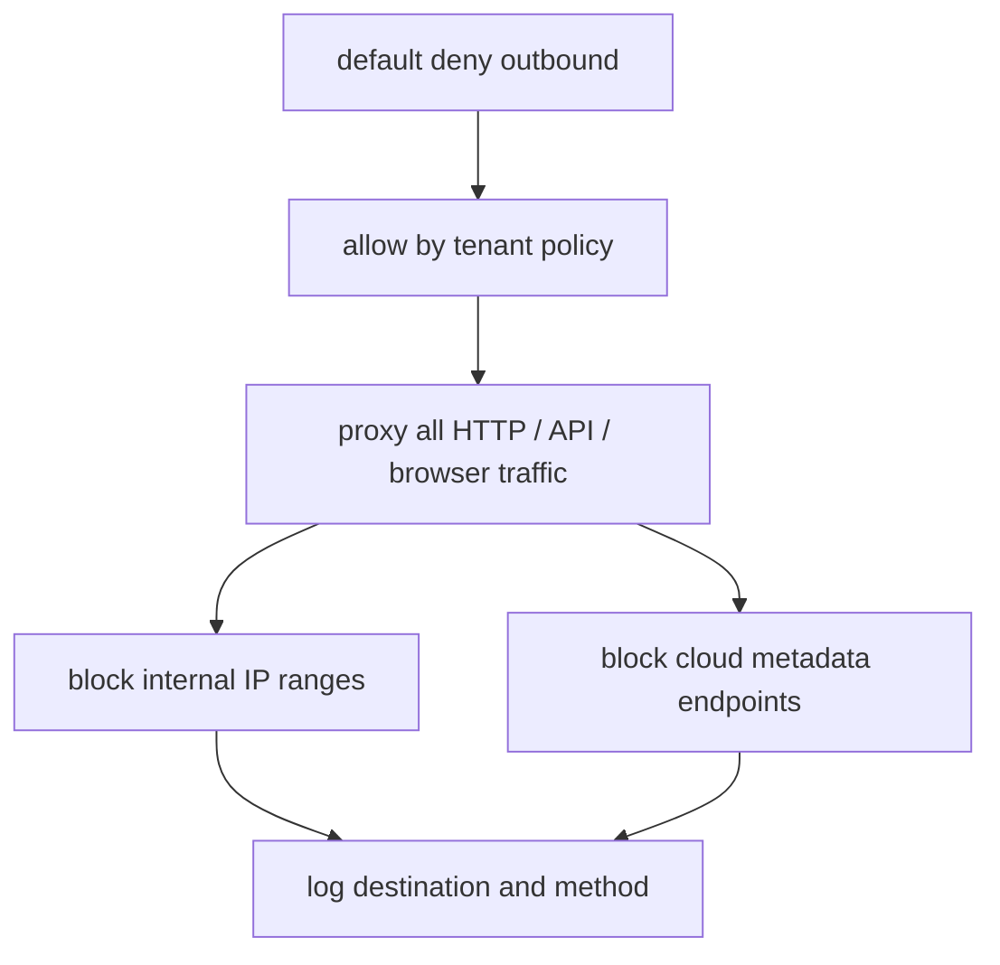

尤其要防：

- SSRF；
- 访问云 metadata；
- 扫描内网；
- 将数据 POST 到未知域名；
- DNS rebinding、redirect 到内网、IPv6 / link-local 绕过；
- WebSocket、文件上传、浏览器下载等非普通 API 外发路径；
- 被网页 prompt injection 引导访问恶意地址。

Browser Agent 也一样。浏览器不是“天然安全”的工具，浏览器只是另一个高风险执行环境；OWASP Prompt Injection 文档明确把网页、文档、邮件等外部内容视为可注入载体。[OWASP Prompt Injection：网页/文档/邮件可成为注入载体](#ref-19)

---

## 九、Browser Agent 怎么用 Sandbox

带登录态或真实副作用的 Browser Agent 要单独建模。Browserbase 文档中的 session、video recording、timeout、keep-alive 等能力说明浏览器自动化本身需要被当作可观察、可管理的会话，而不是一次普通函数调用；Playwright 的 persistent context 也明确 user data directory 会保存 cookies 和 localStorage 等会话状态。[Browserbase：云浏览器 session、录制、timeout 与 keep-alive](#ref-17)；[Browserbase：云浏览器、会话管理、录制、代理](#ref-29)；[Playwright Persistent Context：userDataDir 保存浏览器会话状态](#ref-35)

推荐规则：

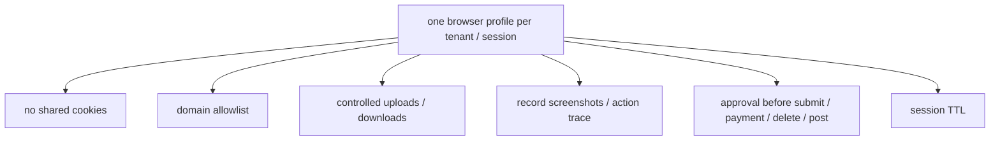

如果 Agent 只是浏览网页，风险还可控；如果它要提交表单、发消息、下单、改设置，就必须走审批或明确的 tenant policy。Cloudflare HITL 文档提供了“暂停 workflow 等待人工确认”的实现参考，OWASP 也建议对高风险 Agent 动作引入 human-in-the-loop。[OWASP AI Agent Security：least privilege、HITL、tool abuse 风险](#ref-18)；[Cloudflare HITL：workflow 暂停等待人工确认](#ref-24)

中断恢复时尤其要注意：

> 不要盲目 replay click。

如果上一次中断发生在“提交”附近，恢复时应该先检查外部系统状态，确认动作是否已经完成，再决定继续、跳过或让用户确认。

---

## 十、产物怎么管理

Sandbox 里的文件不应该直接变成用户可下载文件。OpenAI Code Interpreter 和 E2B 都支持文件进入/离开 sandbox，但 SaaS 产品应在这层之上增加 artifact metadata、访问控制、扫描和审计。[OpenAI/E2B/CubeSandbox：sandbox 用于隔离代码执行和文件处理](#ref-16)；[OpenAI Code Interpreter / E2B：文件进出 sandbox 与产物处理](#ref-26)

推荐所有产物先进入 Artifact Store：

```text
artifact_id
tenant_id
session_id
task_id
created_by_agent
mime_type
size
classification
scan_status
retention_policy
access_policy
```

Artifact Store 要解决：

- 谁能下载；
- 保存多久；
- 是否包含敏感信息；
- 是否需要病毒扫描；
- 是否可以外发；
- 是否进入审计日志。

对于 coding agent，最重要的 artifact 往往不是文件本身，而是：

```text
diff + test result + logs + explanation
```

---

## 十一、危险动作怎么审批

可以把动作分成四级。这个分级是对 OWASP least privilege / human-in-the-loop 建议、Cloudflare workflow approval 模式和 SaaS 审计需求的产品化表达。[OWASP AI Agent Security：least privilege、HITL、tool abuse 风险](#ref-18)；[OWASP Secure Coding with AI：工具权限、输入校验、不可信上下文](#ref-20)；[Cloudflare HITL：workflow 暂停等待人工确认](#ref-24)

### Level 0：只读动作

例如读取文件、读取公开网页、查询已授权文档。

策略：自动允许，记录日志。

### Level 1：Sandbox 内部写入

例如生成文件、修改临时 repo、运行测试。

策略：允许，但不能自动影响生产。

### Level 2：外部可见动作

例如发 Slack、创建 ticket、提交网页表单、创建 PR。

策略：需要 policy allowlist，中高风险时需要用户确认。

### Level 3：高风险动作

例如删除数据、付款、改权限、发布生产、导出大量数据。

策略：默认禁止，除非显式授权 + human approval + full audit。

---

## 十二、选型只需要粗略判断

不要一开始陷入过多 sandbox 实现细节。产品早期更重要的是使用方式，而不是底层技术完美；不同厂商提供的 sandbox 能力不同，层级也不同：代码解释器、浏览器会话、workspace、microVM、容器隔离、workflow 编排不能简单当成等价替代品。[OpenAI/E2B/CubeSandbox：sandbox 用于隔离代码执行和文件处理](#ref-16)；[Browserbase：云浏览器 session、录制、timeout 与 keep-alive](#ref-17)；[Modal Sandboxes：隔离运行代码、命令和文件操作](#ref-37)；[Daytona：agent / developer workspace infrastructure](#ref-38)

粗略选型即可：

| 层级 | 需求 | 可选方案 |
|---|---|---|
| 托管代码执行 | 数据分析、文件处理、短代码运行 | OpenAI Code Interpreter、E2B、Modal、CubeSandbox |
| 浏览器会话 | 网页访问、自动化、录制、profile 管理 | Browserbase、Playwright、CubeSandbox Browser 示例 |
| 持久 workspace | coding agent、长期项目、repo 状态 | Daytona、Codespaces-like workspace、自建 persistent workspace |
| 隔离运行时 | 更强隔离、自托管、高风险代码 | Firecracker-based、Kata、gVisor、microVM |
| 内部低风险任务 | 已知代码、可信网络、低敏数据 | Docker / Kubernetes |

这里的重点不是“哪个技术最强”，而是：

> 不管选哪个 sandbox，都要放在同一套 policy、credential、network、artifact、audit 框架下面使用。[OWASP AI Agent Security：least privilege、HITL、tool abuse 风险](#ref-18)；[OWASP SSRF Prevention：allowlist、阻断内网和 metadata endpoint](#ref-22)；[Cloudflare HITL：workflow 暂停等待人工确认](#ref-24)

---

## 十三、推荐默认方案

如果要做一个 SaaS Agent 产品，我会建议默认这样用。这个默认方案不是来自单一厂商，而是把 OWASP Agent 安全、受控身份、SSRF 防护、HITL、durable workflow、artifact/file handling 等来源组合成 SaaS Agent 的控制面设计；它是架构推导，不是 vendor reference architecture。[OWASP AI Agent Security：least privilege、HITL、tool abuse 风险](#ref-18)；[OWASP SSRF Prevention：allowlist、阻断内网和 metadata endpoint](#ref-22)；[Cloudflare HITL：workflow 暂停等待人工确认](#ref-24)；[Cloudflare Workflows：durable workflow、history、幂等恢复](#ref-25)

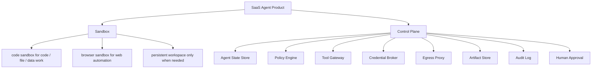

默认策略：

```text
one sandbox lease per run by default
ephemeral by default
checkpoint for long-running tasks
no raw long-lived secrets in sandbox
default-deny internal / metadata / unknown egress
all tools mediated
all high-risk actions approved
all artifacts exported through artifact store
all boundary-crossing actions audited
```

---

## 十四、最重要的反模式

### 1. 把 Sandbox 当成安全模型本身

Sandbox 只是执行隔离。真正的安全模型还包括 policy、credential、network、approval 和 audit。[OWASP AI Agent Security：least privilege、HITL、tool abuse 风险](#ref-18)；[OWASP SSRF Prevention：allowlist、阻断内网和 metadata endpoint](#ref-22)；[Cloudflare HITL：workflow 暂停等待人工确认](#ref-24)

### 2. 给 Agent 一个永不销毁的容器

这会导致成本不可控、状态不可解释、secret 残留、依赖漂移和恢复困难。AWS Lambda execution lifecycle 对环境复用状态的说明、以及 durable workflow 文档对外置状态的强调，都支持“不依赖永不销毁执行环境”的设计。[AWS Lambda Execution Lifecycle：复用会保留 /tmp 与进程内状态](#ref-3)；[Cloudflare Workflows：durable workflow、history、幂等恢复](#ref-25)

### 3. 把客户 Secret 放进 Sandbox

Agent 不应该直接持有长期凭证。应该用短期、窄权限、可撤销的 capability。[Google Cloud Agent Identity：auth manager / credential vault 管理凭证](#ref-21)

### 4. 让 Browser Agent 自动提交关键动作

浏览器里的“点击提交”可能意味着发邮件、下单、付款、删数据。必须有审批边界。[OWASP AI Agent Security：least privilege、HITL、tool abuse 风险](#ref-18)；[OWASP Prompt Injection：网页/文档/邮件可成为注入载体](#ref-19)；[Cloudflare HITL：workflow 暂停等待人工确认](#ref-24)

### 5. 没有外部副作用记录

恢复时最怕重复执行：重复发邮件、重复付款、重复删除。所有外部写动作都要有 idempotency key 和 operation log。[Cloudflare Workflows：durable workflow、history、幂等恢复](#ref-25)

---

## 十五、多租户 SaaS 下的资源模型与配额问题

前面的章节讨论的是“一个 Agent 任务如何安全使用 Sandbox”。但在 SaaS 场景里，还有一个更现实的问题：

> 如果主账号下同时只能存在很少的 sandbox 实例，例如 10 个，那么一个租户多个用户、一个用户多个 session 时，怎么支撑多租户使用？

这里首先要拆清楚四个概念：

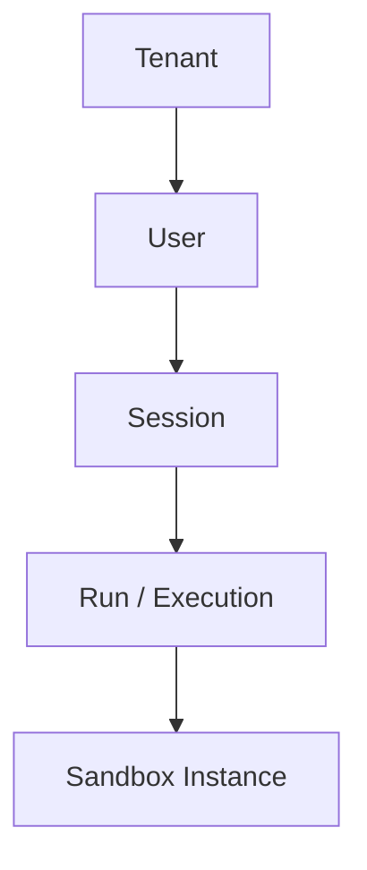

它们不应该是一一绑定关系。一个租户可以有多个用户，一个用户可以打开多个 session，一个 session 里又可能发起多次 run。真正消耗稀缺资源的，通常不是 tenant、user 或 session 本身，而是**正在运行的 run / execution**。这是把 workflow/queue 系统里“持久状态”和“执行资源”分离的思路应用到 sandbox 池后的设计推导；Kubernetes 和 Kueue 在这里是共享资源池调度的类比，不是 SaaS Agent Sandbox 的直接标准。[Kubernetes ResourceQuota：共享资源池需要配额限制](#ref-6)；[Kueue ClusterQueue：quota / borrowing / queueing](#ref-7)；[Cloudflare Workflows：durable workflow、history、幂等恢复](#ref-25)

### 1. 10 个实例不是 10 个租户，而是 10 个并发执行位

文档里写“sandbox 实例数配额 10”时，容易被误读成“最多支持 10 个租户”。在本文假设的固定主账号资源池里，这其实不准确；更接近 Kubernetes ResourceQuota / Kueue ClusterQueue 的资源池模型：配额约束的是可消耗资源，而不是用户或租户数量本身。[Kubernetes ResourceQuota：共享资源池需要配额限制](#ref-6)；[Kueue ClusterQueue：quota / borrowing / queueing](#ref-7)

更准确的说法是：

> 10 个实例表示在这个主账号资源池里，最多同时存在 10 个正在运行或空闲保留的 sandbox 实例。

租户、用户、session 的数量可以远大于 10，因为它们主要是数据库、权限、文件和状态记录；但是**同时占用 sandbox 的执行任务**不能超过这个上限。共享池能够提升效率，但也会引入 noisy neighbor、blast radius 和更复杂的隔离问题，因此需要显式配额与调度策略。[AWS SaaS Lens Pool Isolation：共享池有 noisy neighbor / blast radius 风险](#ref-4)；[Kubernetes ResourceQuota：共享资源池需要配额限制](#ref-6)；[Kueue ClusterQueue：quota / borrowing / queueing](#ref-7)

所以系统容量要先估算单位时间内会有多少 run 到达，再估算每个 run 平均占用 sandbox 多久：

```text
需要的 sandbox 并发数
≈ run 到达率 × 平均 sandbox 占用时长

run 到达率
≈ 活跃租户数
  × 每租户活跃用户数
  × 每用户活跃 session 数
  × 每 session 单位时间内发起 run 的概率/频率
```

这个公式是排队论意义上的容量估算，不是任何 vendor 文档的直接公式；它用于帮助判断配额是否和产品承诺匹配。

如果你的产品是强交互式的，例如用户打开 session 后就期望 sandbox 一直在线，那么这个乘数会非常大。举例：

```text
5 个租户
× 每租户 5 个活跃用户
× 每用户 2 个 session
= 50 个活跃 session
```

哪怕只有一半 session 同时需要执行，也已经是 25 个并发，远超 10。此时问题不是“调度算法不够好”，而是**资源池规模与产品承诺不匹配**；调度系统能改善公平性和利用率，但不能突破资源池的物理或供应商配额。[Kubernetes ResourceQuota：共享资源池需要配额限制](#ref-6)；[Kueue ClusterQueue：quota / borrowing / queueing](#ref-7)；[Kueue Fair Sharing：多队列共享资源需要公平性](#ref-8)

### 2. “每个 session 都要 sandbox”要继续拆语义

你前面提到“基本每个 session 都要”。这句话需要继续拆成三种不同含义：

| 语义 | 是否必须长期占用 sandbox | 设计含义 |
|---|---:|---|
| session 需要保存文件、上下文、浏览器状态 | 不一定 | 状态可以外置到 workspace / artifact / profile store |
| session 随时可能发起代码执行或浏览器动作 | 不一定 | 只在 run 期间绑定 sandbox |
| session 必须保持一个低延迟、独占、在线 runtime | 是 | 每个活跃 session 接近占用 1 个 sandbox |

如果是前两种，仍然可以做“session 很多、sandbox 很少”。如果是第三种，那就要按活跃 session 数规划 sandbox 配额，10 个实例几乎一定不够。这是把 session state 外置、run 临时占用 compute 的设计推导。[E2B Sandbox：按需创建、暂停、恢复 sandbox](#ref-15)；[Cloudflare Workflows：durable workflow、history、幂等恢复](#ref-25)

也就是说，产品定义要从：

```text
session = sandbox
```

改成：

```text
session = durable state + execution lease
```

其中 durable state 是长期的，execution lease 是临时的。

如果设计成：

```text
1 session = 1 长驻 sandbox
```

那么容量会按乘法爆炸：

```text
活跃租户数 × 每租户活跃用户数 × 每用户活跃 session 数
```

这个数量很容易远远超过 10。也就是说，**在固定资源池假设下，10 个 sandbox 实例不是多租户规模，而只是全局并发执行上限**。[Kubernetes ResourceQuota：共享资源池需要配额限制](#ref-6)；[Kueue ClusterQueue：quota / borrowing / queueing](#ref-7)

### 3. 排队不是可选项，而是背压机制

只要资源池有上限，就一定会出现第 11 个请求。第 11 个请求来了，系统必须有明确策略。Kueue 对 admission、queue、quota borrowing 和 fair sharing 的设计可以作为类比；Inngest 的多租户队列文章也可作为工程案例参考，但不是安全标准。[Kueue ClusterQueue：quota / borrowing / queueing](#ref-7)；[Kueue Fair Sharing：多队列共享资源需要公平性](#ref-8)；[Inngest Fair Multi-Tenant Queue：队列层处理公平性与并发](#ref-9)

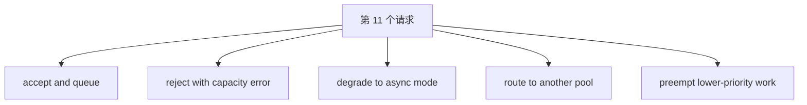

如果不设计队列，排队并不会消失，只是会变成更差的形式：

- API 请求随机超时；
- 用户看到“运行中”但实际没有资源；
- 某个租户连续提交任务占满全部 sandbox；
- 后台任务挤掉交互任务；
- worker 之间争抢同一个空闲实例；
- 清理中的 sandbox 被过早复用。

所以队列/调度层不是“高级优化”，而是有限资源池的基本背压机制。Kueue、Kubernetes ResourceQuota、Pod Priority 这些资料可以作为类比：**共享资源池通常需要 admission control、quota、priority 和 fairness**。[Kubernetes ResourceQuota：共享资源池需要配额限制](#ref-6)；[Kueue ClusterQueue：quota / borrowing / queueing](#ref-7)；[Kueue Fair Sharing：多队列共享资源需要公平性](#ref-8)；[Kubernetes Pod Priority：调度优先级与抢占](#ref-11)

### 4. 等待耗时必须产品化

排队以后，等待时间会进入用户体验。调度和队列资料通常解决资源公平性，但在 SaaS Agent 产品中，这个状态还必须被产品化展示，否则用户无法区分“正在排队”和“系统卡死”。这是由队列背压机制推导出的交互设计建议。[Kueue ClusterQueue：quota / borrowing / queueing](#ref-7)；[Kueue Fair Sharing：多队列共享资源需要公平性](#ref-8)

对后台任务来说，等待几十秒甚至几分钟可能可接受；对交互式 Agent session 来说，等待几秒就会明显影响体验。因此不能只在后端排队，还要在产品层表达资源状态：

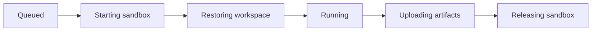

建议交互式 session 至少提供：

- 当前队列位置；
- 预计等待时间；
- 取消按钮；
- 超时提示；
- 降级为后台执行；
- 任务完成后的通知；
- 企业/高优先级通道。

如果做不到这些，用户会把“资源池排队”理解成“Agent 卡死”。

### 5. 频繁重启有成本，但长驻也有成本

每次新建 sandbox 可能包含：

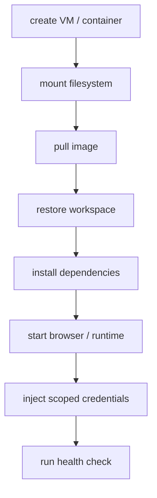

所以频繁重启会带来冷启动延迟，也会增加镜像拉取、依赖安装和状态恢复成本。warm pool、snapshot、pause/resume 这些机制都存在，正是因为冷启动和状态恢复有成本。[OpenKruise Warm Pool：预创建资源降低启动延迟](#ref-10)；[Firecracker Snapshot / Jailer：snapshot 恢复与隔离增强](#ref-13)；[E2B Sandbox：按需创建、暂停、恢复 sandbox](#ref-15)

但反过来，让每个 session 都长驻 sandbox 也有成本；AWS Lambda lifecycle 文档说明执行环境复用会保留状态，SaaS Lens 也提醒共享资源池会带来 noisy neighbor 和 blast radius 风险。[AWS Lambda Execution Lifecycle：复用会保留 /tmp 与进程内状态](#ref-3)；[AWS SaaS Lens Pool Isolation：共享池有 noisy neighbor / blast radius 风险](#ref-4)

- 空闲 session 占住实例；
- 内存、磁盘、浏览器进程长期占用；
- secret、cookie、缓存残留时间变长；
- 依赖状态逐渐漂移；
- 失败恢复更依赖“这个 sandbox 还活着”；
- 10 个实例很快被 idle session 吃完。

所以这里不是“重启好”或“长驻好”，而是要有分层策略：

| 策略 | 适用场景 | 代价 |
|---|---|---|
| 每次 run 新建 | 不可信、跨租户、高安全 | 冷启动高 |
| 同租户复用 | 同 trust boundary、交互式、多轮任务 | 需要严格 reset 和健康检查 |
| idle timeout 后释放 | 大多数 SaaS session | 用户再次运行时要恢复 |
| pause / resume | 需要保留 runtime 状态 | 占用快照/磁盘资源 |
| snapshot restore | 高并发短任务 | 需要维护基础镜像和快照兼容性 |
| warm pool | 降低启动延迟 | 占用一部分固定配额 |

Firecracker snapshot、E2B pause/resume、OpenKruise warm pool 都是在不同层面降低“重启成本”，但它们都没有消除并发上限。[OpenKruise Warm Pool：预创建资源降低启动延迟](#ref-10)；[Firecracker Snapshot / Jailer：snapshot 恢复与隔离增强](#ref-13)；[E2B Sandbox：按需创建、暂停、恢复 sandbox](#ref-15)

### 6. 清理 sandbox 内容可以切换，但要区分安全等级

“能不能清理 sandbox 内容后切换 session？”答案是：**可以做，但不能把它当成跨租户强隔离**。

清理复用至少要清：

```mermaid
graph TD
    RESET["soft reset before reuse"] --> WORKSPACE["workspace files"]
    RESET --> TEMP["temporary files"]
    RESET --> PROCESS["process tree"]
    RESET --> PORTS["open ports"]
    RESET --> JOBS["background jobs"]
    RESET --> ENV["environment variables"]
    RESET --> CRED["short-lived credentials"]
    RESET --> BROWSER["browser profile"]
    RESET --> COOKIES["cookies / localStorage"]
    RESET --> CACHE["package caches"]
    RESET --> NETWORK["network namespace / egress policy"]
    RESET --> VOLUMES["mounted volumes"]
    RESET --> TOOLS["tool call state"]
```

即使这样，也只能算 soft reset。它适合：

- 同一 tenant；
- 同一 user；
- 同一 session 的连续 run；
- 低风险代码；
- 明确不处理敏感数据；
- 可接受残留风险的内部工具。

它不适合：

- 跨 tenant；
- 执行任意用户代码；
- 带客户凭证；
- 带浏览器登录态；
- 合规要求高；
- 强安全隔离场景。

AWS Lambda 的 execution environment lifecycle 很好地说明了这个边界：运行环境复用会保留 `/tmp`、进程内对象、后台进程和连接等状态。因此跨租户复用不能只靠 `rm -rf workspace`，而应该依赖生命周期早期绑定的隔离边界、路由策略和更强 reset / recreate 机制。[AWS Lambda Execution Lifecycle：复用会保留 /tmp 与进程内状态](#ref-3)

### 7. 更实用的隔离分级

可以把 sandbox 复用策略分成四级：

| 级别 | 策略 | 适用场景 |
|---|---|---|
| L0：进程级清理 | 杀进程、清目录、清环境变量 | 内部低风险任务 |
| L1：同租户复用 | tenant sticky sandbox，跨 user/session 受策略限制 | 同租户交互式 Agent |
| L2：快照恢复 | 从可信 snapshot 恢复文件系统和内存基线 | 不可信短任务、高频执行 |
| L3：销毁重建 | 每次跨租户或高风险任务新建隔离环境 | 强隔离、多租户 SaaS、客户代码 |

跨租户默认应该从 L2 或 L3 起步，而不是 L0。Kubernetes multi-tenancy、gVisor、Kata 和 Firecracker 的共同启发是：跨 tenant 边界应优先依赖明确隔离边界，而不是事后清理脚本。[Kubernetes Multi-tenancy：多租户需要控制面/数据面/工作负载隔离](#ref-5)；[gVisor Security Model：sandbox 降低宿主机攻击面](#ref-12)；[Firecracker Snapshot / Jailer：snapshot 恢复与隔离增强](#ref-13)；[Kata Containers：用 VM sandbox 增强容器隔离](#ref-14)

### 8. 最终判断：如果每个活跃 session 都要独占 sandbox，10 个就是不够

更合理的建模是：


```mermaid
graph TD
    SESSION["Session 可以很多"] --> RUN["Run / Execution 临时绑定 Sandbox"]
    SANDBOX["Sandbox 很少"] --> RUN
    RUN --> RELEASE["执行结束后释放、重置、休眠或销毁"]
```

这可以参考 Serverless / Batch / Kubernetes 的资源管理思路：执行环境可以 warm reuse，但并发资源仍需要调度层、配额层和隔离层共同管理。AWS Lambda 的执行环境生命周期文档明确说明，执行环境可能在多次调用之间复用，`/tmp`、进程内对象、连接等状态可能保留，因此不能把执行环境复用等同于天然干净状态。[AWS Lambda Execution Lifecycle：复用会保留 /tmp 与进程内状态](#ref-3)；[Kubernetes ResourceQuota：共享资源池需要配额限制](#ref-6)；[Kueue ClusterQueue：quota / borrowing / queueing](#ref-7)；[Kueue Fair Sharing：多队列共享资源需要公平性](#ref-8)

如果业务上真的要求：

```text
每个活跃 session 都有一个独立、在线、低延迟 sandbox
```

那就不要试图用调度层“变魔术”。这时应该直接承认配额不够，并做：

- 提高供应商配额；
- 多主账号 / 多区域资源池；
- 企业租户专属池；
- 免费租户严格 idle timeout；
- 限制单用户多开 session；
- 把 session 从“长驻 runtime”改成“可恢复 workspace”；
- 对交互式和后台任务分池。

一句话：

> Scheduler 解决公平性，queue 解决背压，warm pool 解决冷启动，snapshot 解决恢复速度；但它们都不能把 10 个 sandbox 实例变成无限并发。

---

## 十六、有限 Sandbox 下的架构收束

前面已经说明了资源模型：session 不等于 sandbox，run 才临时占用 sandbox。把这个模型落到系统里，建议出现一个明确的 **Sandbox Scheduler / Sandbox Manager**。这是把 Kubernetes ResourceQuota、Kueue ClusterQueue/Fair Sharing、Pod Priority 和多租户队列思想应用到 sandbox 资源池后的设计推导；它们是资源调度参考，不是 SaaS Agent 安全模型的完整证明。[Kubernetes ResourceQuota：共享资源池需要配额限制](#ref-6)；[Kueue ClusterQueue：quota / borrowing / queueing](#ref-7)；[Kueue Fair Sharing：多队列共享资源需要公平性](#ref-8)；[Kubernetes Pod Priority：调度优先级与抢占](#ref-11)

推荐结构：

```mermaid
graph TD
    ACTOR["Tenant / User / Session"] --> ORCH["Agent Orchestrator"]
    ORCH --> SCHED["Sandbox Scheduler"]
    SCHED --> GLOBAL["Global Quota"]
    SCHED --> TENANT["Tenant Quota"]
    SCHED --> USER["User Quota"]
    SCHED --> SESSION["Session / Run Quota"]
    SCHED --> FAIR["Priority / Fairness"]
    SCHED --> QUEUE["Queue / Timeout / Cancel"]

    ORCH --> WARM["Warm Pool"]
    ORCH --> SNAPSHOT["Snapshot / Workspace Store"]
    ORCH --> ARTIFACT["Artifact Store"]
    ORCH --> AUDIT["Audit Log"]
```

### 1. Scheduler 的职责

Scheduler 至少要回答这些问题：

- 这个 run 是否应该被接纳；
- 应该进入哪个资源池；
- 是否超过 global / tenant / user / session 配额；
- 如果资源不足，是排队、失败、降级、转移还是抢占；
- sandbox 租约何时过期，何时释放、暂停、恢复或销毁。

如果没有显式 Scheduler，这些问题不会消失，只会表现为随机超时、资源争抢或某个租户占满全部实例。Kueue 的 ClusterQueue / Fair Sharing 文档可以作为类比：共享资源池需要 nominal quota、borrowing / lending、队列策略和公平调度规则。[Kueue ClusterQueue：quota / borrowing / queueing](#ref-7)；[Kueue Fair Sharing：多队列共享资源需要公平性](#ref-8)

### 2. 配额要分层，而不是只看全局 10 个

推荐至少有四层配额：

```text
global_sandbox_limit = 10
tenant_concurrency_limit
user_concurrency_limit
session_concurrency_limit
```

例如：

```text
全局最多 10 个 sandbox
租户 A 最多 4 个并发
租户 B 最多 2 个并发
单用户最多 2 个并发
单 session 最多 1 个活跃 run
```

SaaS sandbox 池可以参考 Kubernetes ResourceQuota 的资源配额模型，只是资源对象从 Pod / CPU / Memory 换成了 Sandbox Instance，并且还要额外处理凭证、浏览器状态和外部副作用。[Kubernetes ResourceQuota：共享资源池需要配额限制](#ref-6)

### 3. 交互式 session 和后台 run 要分池

不是所有 sandbox 请求都一样。

可以分成：

| 类型 | 特点 | 策略 |
|---|---|---|
| 交互式 session | 用户正在等结果，延迟敏感 | 高优先级、短超时、可使用 warm pool |
| 后台任务 | 用户不盯着屏幕等 | 可排队、可重试、可低优先级 |
| 长任务 | 容易长期占用 sandbox | 最大运行时长、checkpoint、可中断恢复 |
| 免费租户任务 | 成本敏感 | 更低并发、更长排队、更短 idle timeout |
| 企业租户任务 | SLA 敏感 | 保留并发、独立 quota、可选专属池 |

这可以类比 Kubernetes PriorityClass / Pod Priority：调度队列需要知道哪些任务应该优先进入资源池，哪些任务可以等待，哪些任务可以被延迟或抢占。[Kubernetes Pod Priority：调度优先级与抢占](#ref-11)

### 4. Warm Pool 只能降低冷启动，不能增加容量

Warm pool 的作用是提前准备好若干空闲 sandbox，让新的 run 可以快速绑定。

例如：

```text
10 个总配额
2 个保持 warm idle
8 个按需运行
```

它能降低冷启动时间，但不能突破 10 个并发上限。OpenKruise Warm Pool 文档展示了类似机制：提前创建一组 standby 资源，业务需要时再 claim，从而降低启动延迟。[OpenKruise Warm Pool：预创建资源降低启动延迟](#ref-10)

Firecracker 的 snapshot / restore 则是另一种降低冷启动的方式：把已经初始化好的 microVM 状态快照化，需要时快速恢复。[Firecracker Snapshot / Jailer：snapshot 恢复与隔离增强](#ref-13) 对 sandbox 平台来说，这可以作为高频短任务的底层优化参考，但仍要遵守前面说的 snapshot 安全边界。

### 5. Session 状态必须外置

如果每个 session 都依赖一个永远活着的 sandbox，那么配额很快耗尽，恢复也很脆弱。

更稳的方式是：

```mermaid
graph LR
    SESSION["Session State"] --> METADATA["session metadata"]
    METADATA --> DB["database"]
    SESSION --> PLAN["agent plan / cursor"]
    PLAN --> STATE["workflow / state store"]
    SESSION --> HISTORY["execution history"]
    HISTORY --> LOG["workflow event history / execution log"]
    SESSION --> WORKSPACE["workspace files"]
    WORKSPACE --> OBJECT["object store / volume / git branch"]
    SESSION --> UPLOADS["user uploads"]
    UPLOADS --> FILES["user file store / artifact store"]
    SESSION --> BROWSER["browser profile"]
    BROWSER --> PROFILE["encrypted profile store"]
    SESSION --> ARTIFACTS["execution artifacts"]
    ARTIFACTS --> ARTIFACT_STORE["artifact store"]
    SESSION --> RUNTIME["sandbox runtime"]
    RUNTIME --> COMPUTE["disposable / resumable compute / runtime snapshot"]
```

这样 session 可以很多，但真正占用 sandbox 的只有正在执行的 run。E2B 的 sandbox 文档可以作为“会话级 sandbox 可以暂停、恢复、保留状态”的参考，但这类能力仍然需要配额和生命周期管理，不能等同于无限长驻。[E2B Sandbox：按需创建、暂停、恢复 sandbox](#ref-15)

### 6. 清理后切换 session 可以做，但不能当成跨租户强隔离

这是最容易误判的地方。

在同一租户、同一 trust boundary、低风险场景下，可以考虑 sandbox 复用：

```mermaid
graph TD
    KILL["kill processes"] --> WORKSPACE["clear workspace"]
    WORKSPACE --> ENV["clear env vars"]
    ENV --> NETWORK["reset network rules"]
    NETWORK --> TEMP["clear temp files"]
    TEMP --> CRED["rotate short-lived credentials"]
    CRED --> HEALTH["health check"]
    HEALTH --> POOL["return to pool"]
```

但跨租户场景不能只靠 `rm -rf workspace`。原因是执行环境里可能残留：

- `/tmp` 文件；
- 内存对象；
- 后台进程；
- 打开的 socket；
- 浏览器 cookie / localStorage；
- 包缓存；
- 语言运行时状态；
- 用户凭证或短期 token；
- 网络连接池。

AWS Lambda 的 execution environment lifecycle 很好地说明了这个问题：运行环境复用会保留 `/tmp`、进程内对象、后台进程和连接等状态。因此跨租户场景不能只靠运行后清理脚本，而应该优先依赖生命周期早期绑定的隔离边界、路由策略和更强的 reset / recreate 机制。[AWS Lambda Execution Lifecycle：复用会保留 /tmp 与进程内状态](#ref-3)

Kubernetes 多租户文档也提醒，容器共享宿主机内核，隔离强度取决于安全边界；对不可信工作负载，通常需要更强的 sandboxed containers 或 VM 级隔离。[Kubernetes Multi-tenancy：多租户需要控制面/数据面/工作负载隔离](#ref-5) gVisor、Kata Containers、Firecracker 这类方案，本质上都是在增强这个隔离边界。[gVisor Security Model：sandbox 降低宿主机攻击面](#ref-12)；[Firecracker Snapshot / Jailer：snapshot 恢复与隔离增强](#ref-13)；[Kata Containers：用 VM sandbox 增强容器隔离](#ref-14)

### 7. 什么时候 10 个就是根本不够

如果产品承诺的是：

```text
每个活跃 session 都有一个独立、低延迟、随时可运行的 sandbox
```

那么 10 个实例就是结构性不足，而不是调度层能完全解决的问题。

这时只有几类解法：

- 向供应商申请更高 sandbox 实例配额；
- 多主账号 / 多区域 / 多资源池分片；
- 企业租户提供专属池；
- 免费租户限制并发和 idle 时间；
- 把产品语义从“session 长驻 sandbox”改成“run 临时占用 sandbox”；
- 用 pause / resume / snapshot 降低恢复成本；
- 把 session 状态外置，避免把 sandbox 当数据库。

一句话：

> Scheduler 解决公平性和利用率，warm pool 解决冷启动，snapshot 解决恢复速度，但它们都不能把 10 个并发实例变成无限并发。

---

## 十七、Sandbox 生命周期到底谁管理

前面已经把 sandbox 拆成执行环境、状态、配额、调度、凭证、网络和审计几个部分。这里可以再回答一个更工程化的问题：

> sandbox 的生命周期，应该由外部系统管理后注入给 Agent 使用，还是由 Agent 框架内部自己管理？

我的结论是：

> **SaaS 产品里，sandbox 生命周期的最终所有权应该在外部控制面；Agent 框架可以封装使用体验，但不应该成为资源、权限、配额和审计的唯一 owner。**

原因不是“Agent 框架做不到”，而是 sandbox 生命周期同时牵涉四类 Agent 框架通常不应该单独决定的事情：

- 多租户配额；
- 安全边界；
- 成本和 idle 回收；
- 外部副作用恢复。

E2B、Browserbase、Modal 这类 sandbox / browser 平台都把生命周期暴露成可控制的资源对象：创建、timeout、pause / resume、keep alive、terminate、detach、从 id 重新连接、查看状态等；LangGraph / OpenAI Agents SDK 这类 Agent 框架则更强调 thread / session / checkpointer / memory 的持久化；Temporal 这类 workflow 系统进一步把外部 I/O 放到 Activity，把 workflow history 作为恢复依据。[E2B Sandbox Persistence：pause/resume、timeout、kill 生命周期](#ref-31)；[Browserbase Manage Browser Session：timeout、keep alive、manual termination](#ref-29)；[Modal Sandboxes：lifecycle events、timeout、terminate、from_id](#ref-37)；[LangGraph Persistence：thread、checkpoint、store](#ref-39)；[OpenAI Agents SDK Sessions：session memory 与多种后端](#ref-40)；[Temporal Workflow：event history 与 activity 处理外部 I/O](#ref-41)

### 1. 两种方案的差别

可以把两种方案写成这样：

```mermaid
graph TD
    PLAN_A["方案 A：框架内部管理"] --> AGENT_A["Agent Framework"]
    AGENT_A --> CREATE_A["create sandbox"]
    AGENT_A --> USE_A["run tools"]
    AGENT_A --> CLEAN_A["cleanup"]

    PLAN_B["方案 B：外部控制面管理"] --> ORCH_B["Product Orchestrator"]
    ORCH_B --> SCHED_B["Sandbox Scheduler"]
    SCHED_B --> SB_B["Sandbox Instance"]
    ORCH_B --> CAP_B["inject capability / session id / client"]
    CAP_B --> AGENT_B["Agent Framework"]
    AGENT_B --> USE_B["use sandbox through tools"]
```

方案 A 的优点是接入快：开发者只要调用 Agent 框架，框架内部帮你拉起 sandbox、运行工具、清理环境。它适合 demo、本地开发、单用户工具、内部低风险任务。

方案 B 的优点是边界清楚：谁能创建 sandbox、创建多久、属于哪个 tenant、能访问哪些域名、是否允许复用、什么时候回收、如何审计，都由产品控制面统一决定。它适合真正的 SaaS、多租户、带客户数据、带浏览器登录态、需要计费和 SLA 的场景。

### 2. 为什么不能只让 Agent 框架自己管

Agent 框架天然关心的是“如何完成任务”：planning、tool calling、memory、handoff、streaming、human-in-the-loop。它可以知道当前 run 需要一个 shell 或 browser，但它不一定掌握全局资源事实：

```text
当前 tenant 还有多少并发？
这个 user 是否超过免费额度？
这个 session 是否允许 keep alive？
当前 sandbox 是否能跨 run 复用？
这个 browser profile 是否包含登录态？
这个 run 是否访问了受限域名？
这个 sandbox 的成本应该记到哪个 tenant？
失败恢复时上一次外部动作是否已经生效？
```

这些问题属于 SaaS control plane，而不是单个 Agent loop。LangGraph 的 persistence 文档虽然提供 checkpointer / store 来恢复 graph state，但它保存的是 Agent 执行状态，不是替代资源调度器；OpenAI Agents SDK 的 sessions 也提供 SQLite、Redis、SQLAlchemy、Dapr、MongoDB、EncryptedSession 等后端，但它管理的是对话记忆和会话上下文历史，不是多租户 sandbox 池。[LangGraph Persistence：thread、checkpoint、store](#ref-39)；[OpenAI Agents SDK Sessions：session memory 与多种后端](#ref-40)

Temporal 的模型也说明了这个分层：workflow history 是恢复依据，外部 API、数据库、文件 I/O、LLM 调用等放在 Activity；恢复时 replay history，而不是指望某个 worker 或执行环境永远活着。[Temporal Workflow：event history 与 activity 处理外部 I/O](#ref-41) 对 Agent sandbox 来说，类似地：Agent workflow 可以恢复，sandbox runtime 可以重建或恢复，但外部副作用、配额和资源租约必须有独立记录。

### 3. 推荐的 ownership 划分

更实用的设计是把 owner 拆开：

| 层 | owner | 负责什么 |
|---|---|---|
| Product / Tenant Policy | SaaS 控制面 | tenant、user、plan、权限、合规、成本归属 |
| Sandbox Scheduler | 外部资源管理层 | admission、quota、queue、priority、warm pool、reuse、timeout |
| Credential Broker | 外部安全层 | 短期凭证、scope、撤销、secret 不落入长期 sandbox |
| Network / Tool Gateway | 外部边界层 | egress allowlist、tool permission、idempotency、approval、audit |
| Agent Framework | Agent 运行层 | planning、tool calling、memory、发起/承接 HITL 交互、错误恢复、上下文压缩 |
| Sandbox Runtime | 执行现场 | 运行代码、浏览器、文件读写、测试、生成产物 |

也就是说，Agent 框架可以“请求一个 capability”，但不应该自己无限制地“拥有一台机器”。

推荐调用关系是：

```mermaid
sequenceDiagram
    participant User
    participant Orchestrator
    participant Scheduler as Sandbox Scheduler
    participant Broker as Credential Broker
    participant Agent as Agent Framework
    participant Sandbox
    participant Audit

    User->>Orchestrator: start task / continue session
    Orchestrator->>Scheduler: request sandbox lease
    Scheduler->>Scheduler: quota / priority / reuse policy
    Scheduler-->>Orchestrator: sandbox_id + lease + timeout
    Orchestrator->>Broker: issue scoped capability
    Orchestrator->>Agent: run with sandbox client / session id / tool capability
    Agent->>Sandbox: execute through mediated tools
    Sandbox-->>Agent: stdout / files / browser state
    Agent-->>Orchestrator: result + artifacts
    Orchestrator->>Audit: record boundary-crossing events
    Orchestrator->>Scheduler: release / pause / checkpoint / kill
```

这里注入给 Agent 的不应该是 root credential 或底层云账号，而应该是受限能力：

```text
sandbox_ref = {
  sandbox_id,
  lease_id,
  tenant_id,
  session_id,
  run_id,
  expires_at,
  allowed_tools,
  network_policy_ref,
  artifact_policy_ref,
  credential_scope_ref
}
```

Agent 只拿到“可以用什么”的句柄，不拿到“可以无限创建和保留什么”的权力。

### 4. 框架内部管理什么时候可以接受

这不是说 Agent 框架内部完全不能管理 sandbox。它可以在这些场景里直接管理：

- 本地开发；
- 单用户 CLI；
- demo / prototype；
- 内部可信任务；
- 没有多租户、没有客户凭证、没有浏览器登录态；
- 每个 run 都短生命周期，结束即销毁；
- sandbox provider 本身已经提供了足够强的平台级控制面。

例如 OpenAI Code Interpreter / hosted tools 这类托管能力，本质上就是平台替你管理了一部分 sandbox 生命周期；Browserbase Functions 也会自动创建和管理 browser session；E2B 的 auto-resume 能让暂停的 sandbox 在活动到来时自动恢复。[OpenAI Code Interpreter：sandboxed Python、文件和图像产物](#ref-30)；[Browserbase Manage Browser Session：timeout、keep alive、manual termination](#ref-29)；[E2B Sandbox Persistence：pause/resume、timeout、kill 生命周期](#ref-31)

但这类“框架内部管理”要成立，有一个前提：**它管理的是某个受控边界内的资源，而不是绕过产品控制面直接拥有生产权限。**

### 5. SaaS 产品里的默认答案

所以，SaaS Agent 的默认答案不是二选一，而是分层：

```text
外部控制面 owns lifecycle
Agent 框架 owns reasoning loop
Sandbox provider owns runtime primitives
Workflow / state store owns recovery truth
Tool gateway owns external side effects
```

更短地说：

> 外部系统管“能不能创建、用多久、归谁、怎么回收、怎么审计”；Agent 框架管“拿到受限能力之后怎么完成任务”。

如果把 sandbox 生命周期完全塞进 Agent 框架，早期会很方便，但到多租户、配额、成本、凭证、审计、恢复时会变成黑盒。更稳的做法是：Agent 框架内部可以有 adapter / resource provider，但真正的 lifecycle policy、lease、quota、credential、audit 仍然由外部控制面决定。

这里的“外部控制面”不一定意味着必须自建一套完整 sandbox 平台。它可以是 sandbox provider / agent platform 提供的托管控制面，再叠加产品自己的 tenant policy、计费、审批和审计映射；关键是生命周期策略不能藏在单个 Agent loop 里。

---

## 十八、最终判断

SaaS Agent 使用 Sandbox 的重点不是“选 Docker、KVM 还是 Firecracker”。

真正的问题是：

> Agent 的每一次行动，是否都被放进了可控、可恢复、可审计的执行边界里？

最实用的原则是：

```mermaid
graph TD
    THINK["Think freely"] --> ACT["Act through controlled sandboxed workflows"]
    ACT --> STATE["Persist state outside the sandbox"]
    ACT --> APPROVE["Approve dangerous actions"]
    ACT --> AUDIT["Audit everything that crosses a boundary"]
```

这才是 SaaS Agent 场景下 Sandbox 的正确使用方式。

---

## 十九、参考文献

以下仅保留完整出处。正文中的引用链接已经直接写明该来源支撑的具体内容。

- <a id="ref-3"></a>[3] [AWS Lambda Execution Environment Lifecycle](https://docs.aws.amazon.com/lambda/latest/dg/lambda-runtime-environment.html)
- <a id="ref-4"></a>[4] [AWS SaaS Lens - Pool Isolation](https://docs.aws.amazon.com/wellarchitected/latest/saas-lens/pool-isolation.html)
- <a id="ref-5"></a>[5] [Kubernetes Multi-tenancy](https://kubernetes.io/docs/concepts/security/multi-tenancy/)
- <a id="ref-6"></a>[6] [Kubernetes Resource Quotas](https://kubernetes.io/docs/concepts/policy/resource-quotas/)
- <a id="ref-7"></a>[7] [Kueue ClusterQueue](https://kueue.sigs.k8s.io/docs/concepts/cluster_queue/)
- <a id="ref-8"></a>[8] [Kueue Fair Sharing](https://kueue.sigs.k8s.io/docs/concepts/fair_sharing/)
- <a id="ref-9"></a>[9] [Inngest: Building a Fair Multi-Tenant Queue](https://www.inngest.com/blog/building-the-inngest-queue-pt-i-fairness-multi-tenancy)
- <a id="ref-10"></a>[10] [OpenKruise Warm Pool Management](https://openkruise.io/kruiseagents/user-manuals/warmpool-management)
- <a id="ref-11"></a>[11] [Kubernetes Pod Priority and Preemption](https://kubernetes.io/docs/concepts/scheduling-eviction/pod-priority-preemption/)
- <a id="ref-12"></a>[12] [gVisor Security Model](https://gvisor.dev/docs/architecture_guide/security/)
- <a id="ref-13"></a>[13] [Firecracker Snapshot Support / Jailer](https://github.com/firecracker-microvm/firecracker/blob/main/docs/snapshotting/snapshot-support.md)
- <a id="ref-14"></a>[14] [Kata Containers Architecture](https://github.com/kata-containers/kata-containers/blob/main/docs/design/architecture/README.md)
- <a id="ref-15"></a>[15] [E2B Sandbox Documentation](https://e2b.dev/docs/sandbox)
- <a id="ref-16"></a>[16] [OpenAI Code Interpreter](https://developers.openai.com/api/docs/guides/tools-code-interpreter)
- <a id="ref-17"></a>[17] [Browserbase Documentation](https://docs.browserbase.com/)
- <a id="ref-18"></a>[18] [OWASP AI Agent Security Cheat Sheet](https://cheatsheetseries.owasp.org/cheatsheets/AI_Agent_Security_Cheat_Sheet.html)
- <a id="ref-19"></a>[19] [OWASP LLM Prompt Injection Prevention](https://cheatsheetseries.owasp.org/cheatsheets/LLM_Prompt_Injection_Prevention_Cheat_Sheet.html)
- <a id="ref-20"></a>[20] [OWASP Secure Coding with AI Cheat Sheet](https://cheatsheetseries.owasp.org/cheatsheets/Secure_Coding_with_AI_Cheat_Sheet.html)
- <a id="ref-21"></a>[21] [Google Cloud Agent Identity](https://docs.cloud.google.com/agent-builder/agent-engine/agent-identity)
- <a id="ref-22"></a>[22] [OWASP SSRF Prevention Cheat Sheet](https://cheatsheetseries.owasp.org/cheatsheets/Server_Side_Request_Forgery_Prevention_Cheat_Sheet.html)
- <a id="ref-24"></a>[24] [Cloudflare Human-in-the-loop Patterns](https://developers.cloudflare.com/agents/guides/human-in-the-loop/)
- <a id="ref-25"></a>[25] [Cloudflare Rules of Workflows](https://developers.cloudflare.com/workflows/build/rules-of-workflows)
- <a id="ref-26"></a>[26] [E2B Code Interpreter Sandbox Reference](https://e2b.dev/docs/sdk-reference/code-interpreter-js-sdk/v2.3.3/sandbox)
- <a id="ref-29"></a>[29] [Browserbase Manage Browser Session](https://docs.browserbase.com/fundamentals/manage-browser-session)
- <a id="ref-30"></a>[30] [OpenAI Code Interpreter](https://developers.openai.com/api/docs/guides/tools-code-interpreter)
- <a id="ref-31"></a>[31] [E2B Sandbox Persistence](https://e2b.dev/docs/sandbox/persistence)
- <a id="ref-32"></a>[32] [E2B Sandbox Snapshots](https://e2b.dev/docs/sandbox/snapshots)
- <a id="ref-33"></a>[33] [Firecracker Snapshot Page Fault Handling](https://github.com/firecracker-microvm/firecracker/blob/main/docs/snapshotting/handling-page-faults-on-snapshot-resume.md)
- <a id="ref-34"></a>[34] [Docker checkpoint CLI](https://docs.docker.com/reference/cli/docker/checkpoint/)
- <a id="ref-35"></a>[35] [Playwright BrowserType API](https://playwright.dev/docs/api/class-browsertype)
- <a id="ref-36"></a>[36] [Chromium User Data Directory](https://chromium.googlesource.com/chromium/src/+/HEAD/docs/user_data_dir.md)
- <a id="ref-37"></a>[37] [Modal Sandboxes](https://modal.com/docs/guide/sandbox)
- <a id="ref-38"></a>[38] [Daytona Docs](https://www.daytona.io/docs)
- <a id="ref-39"></a>[39] [LangGraph Persistence](https://docs.langchain.com/oss/python/langgraph/persistence)
- <a id="ref-40"></a>[40] [OpenAI Agents SDK Sessions](https://openai.github.io/openai-agents-python/sessions/)
- <a id="ref-41"></a>[41] [Temporal Workflow](https://docs.temporal.io/workflows)
